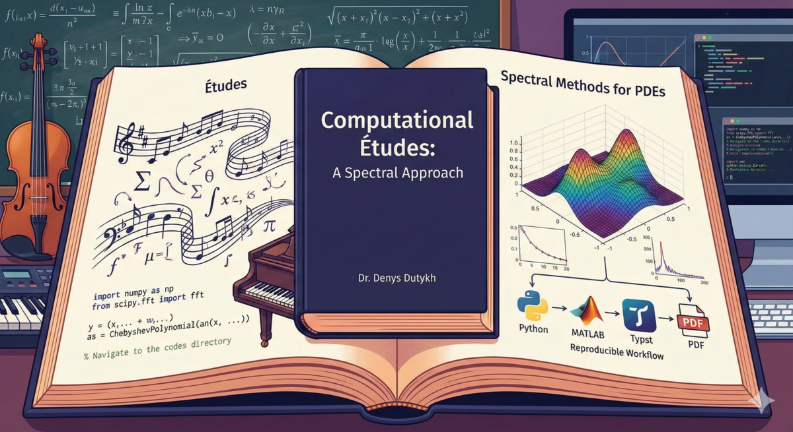

# Computational Études: A Spectral Approach

[](https://creativecommons.org/licenses/by-nc-sa/4.0/)
[](https://typst.app/)



> A pedagogical textbook on spectral methods for differential equations, featuring triple-language implementations in Python, MATLAB, and Julia.

**Author:** Dr. Denys Dutykh
**Affiliation:** Mathematics Department, Khalifa University of Science and Technology, Abu Dhabi, UAE

---

## About This Book

Spectral methods are a powerful class of numerical techniques for solving differential equations. Unlike finite difference or finite element methods, which use local approximations, spectral methods represent solutions as linear combinations of global basis functions—typically Fourier series or Chebyshev polynomials. For smooth problems, this approach yields *spectral accuracy*: errors that decay exponentially fast with the number of degrees of freedom.

This book takes a hands-on, pedagogical approach inspired by musical *études*—short compositions designed to develop specific technical skills while remaining artistically complete. Each chapter focuses on a single mathematical concept and explores it through compact, runnable code implementations.

### Key Features

- **Étude-based pedagogy** — Each chapter is a self-contained study combining theory with implementation
- **Triple-language implementations** — All examples provided in Python, MATLAB, and Julia
- **Fully reproducible** — Every figure and result generated from the accompanying code
- **Focus on 1D problems** — Keeps code readable while covering all essential concepts
- **Beautiful typography** — Professionally typeset using Typst with bibliography backreferences

---

## Table of Contents

- **Preface** — Purpose, audience, and how to use this book
- **Acknowledgements** — Thanks to contributing students
1. **Introduction** — The spectral promise, philosophy of études, collocation methods, and modern workflows
2. **Classical Second Order PDEs and Separation of Variables** — Heat, wave, and Laplace equations; separation of variables as the foundation for spectral methods
3. **Mise en Bouche** — A first taste of spectral methods: method of weighted residuals, collocation vs. Galerkin with low-dimensional examples
4. **The Geometry of Nodes** — Runge phenomenon, potential theory, Chebyshev points, Lebesgue constants, and barycentric interpolation
5. **Differentiation Matrices** — Finite differences as sparse approximations, periodic spectral matrices, Fornberg's algorithm, and spectral convergence
6. **Smoothness and Spectral Accuracy** — Fourier coefficient decay, aliasing, convergence theorems, and the quantum harmonic oscillator
7. **Chebyshev Differentiation Matrices** — Non-periodic spectral methods on bounded domains, Chebyshev-Gauss-Lobatto points, explicit matrix formulas
8. **Boundary Value Problems** — Spectral collocation for BVPs, matrix surgery for boundary conditions, eigenvalue problems, 2D Poisson equation, nonlinear problems
9. **Physical and Fourier Space on Grids** — Continuous, semidiscrete, and discrete Fourier transforms; aliasing and the Nyquist interval; band-limited interpolation; FFT spectra and smoothness
10. **Spectral PDE Solvers with Chebyshev and Fourier Grids** — Chebyshev differentiation via FFT; method of lines; 1D and 2D wave equations; 1D and 2D heat equations; Poisson and Helmholtz equations; variable coefficient transport

*Additional chapters in development.*

---

## Getting Started

### Prerequisites

**For building the book:**
- [Typst](https://typst.app/) (modern typesetting system)

**For running Python code:**
- Python 3.8+
- NumPy
- SciPy
- Matplotlib

**For running Julia code:**
- Julia 1.10+
- CairoMakie.jl (plotting)
- FFTW.jl (Fast Fourier Transform)

**For running MATLAB code (optional):**
- MATLAB R2020a or later
- [Advanpix Multiprecision Computing Toolbox](https://www.advanpix.com/) (optional, for extended precision)

### Building the Book

```bash
# Clone the repository
git clone https://github.com/dutykh/computational-etudes.git
cd computational-etudes

# Build the PDF textbook
make textbook

# Generate Python figures
make figures-python

# Generate Julia figures
make figures-julia

# Build the teaching plan
make tplan

# Build everything
make all
```

The compiled PDF will be available at `textbook/build/DD-Computational-Etudes-2026.pdf`.

### Running the Code

**Python:**
```bash
# Chapter 2: Classical PDEs
python codes/python/ch02/heat_equation_evolution.py
python codes/python/ch02/heat_equation_waterfall.py
python codes/python/ch02/wave_equation_evolution.py
python codes/python/ch02/wave_equation_waterfall.py
python codes/python/ch02/laplace_equation_2d.py

# Chapter 3: Mise en Bouche
python codes/python/ch03/collocation_example1.py
python codes/python/ch03/collocation_vs_galerkin.py

# Chapter 4: The Geometry of Nodes
python codes/python/ch04/runge_phenomenon.py
python codes/python/ch04/chebyshev_success.py
python codes/python/ch04/chebyshev_points_circle.py
python codes/python/ch04/equipotential_curves.py
python codes/python/ch04/lagrange_basis.py
python codes/python/ch04/lebesgue_functions.py
python codes/python/ch04/convergence_comparison.py

# Chapter 5: Differentiation Matrices
python codes/python/ch05/fd_matrix_bandwidth.py
python codes/python/ch05/spectral_matrix_structure.py
python codes/python/ch05/stencil_pyramid.py
python codes/python/ch05/periodic_cardinal_functions.py
python codes/python/ch05/spectral_derivatives_demo.py
python codes/python/ch05/higher_order_derivatives.py
python codes/python/ch05/convergence_comparison.py

# Chapter 6: Smoothness and Spectral Accuracy
python codes/python/ch06/fourier_decay.py
python codes/python/ch06/aliasing_demo.py
python codes/python/ch06/convergence_rates.py
python codes/python/ch06/harmonic_oscillator.py

# Chapter 7: Chebyshev Differentiation Matrices
python codes/python/ch07/cheb_matrix.py
python codes/python/ch07/cheb_diff_demo.py
python codes/python/ch07/cheb_convergence.py
python codes/python/ch07/cheb_grid_comparison.py
python codes/python/ch07/cheb_matrix_structure.py
python codes/python/ch07/cheb_cardinal.py

# Chapter 8: Boundary Value Problems
python codes/python/ch08/bvp_linear.py
python codes/python/ch08/bvp_variable_coeff.py
python codes/python/ch08/bvp_eigenvalue.py
python codes/python/ch08/bvp_2d_poisson.py
python codes/python/ch08/bvp_helmholtz.py
python codes/python/ch08/bvp_nonlinear.py

# Chapter 9: Physical and Fourier Space on Grids
python codes/python/ch09/two_views_function.py
python codes/python/ch09/aliasing_demo.py
python codes/python/ch09/sinc_interpolation.py
python codes/python/ch09/fft_aliasing.py
python codes/python/ch09/smoothness_spectra.py
python codes/python/ch09/zero_padding_interpolation.py

# Chapter 10: Spectral PDE Solvers
python codes/python/ch10/chebfft.py
python codes/python/ch10/cheb_fourier_geometry.py
python codes/python/ch10/chebfft_accuracy.py
python codes/python/ch10/wave1d_cheb.py
python codes/python/ch10/wave2d_cheb.py
python codes/python/ch10/heat1d_cheb.py
python codes/python/ch10/heat2d_cheb.py
python codes/python/ch10/poisson2d_cheb.py
python codes/python/ch10/transport_variable.py
```

**Julia:**
```bash
# Chapter 2: Classical PDEs
julia codes/julia/ch02/heat_equation_evolution.jl
julia codes/julia/ch02/heat_equation_waterfall.jl
julia codes/julia/ch02/wave_equation_evolution.jl
julia codes/julia/ch02/wave_equation_waterfall.jl
julia codes/julia/ch02/laplace_equation_2d.jl

# Chapter 3: Mise en Bouche
julia codes/julia/ch03/collocation_example1.jl
julia codes/julia/ch03/collocation_vs_galerkin.jl

# Chapter 4: The Geometry of Nodes
julia codes/julia/ch04/runge_phenomenon.jl
julia codes/julia/ch04/chebyshev_success.jl
julia codes/julia/ch04/chebyshev_points_circle.jl
julia codes/julia/ch04/equipotential_curves.jl
julia codes/julia/ch04/lagrange_basis.jl
julia codes/julia/ch04/lebesgue_functions.jl
julia codes/julia/ch04/convergence_comparison.jl

# Chapter 5: Differentiation Matrices
julia codes/julia/ch05/fd_matrix_bandwidth.jl
julia codes/julia/ch05/spectral_matrix_structure.jl
julia codes/julia/ch05/stencil_pyramid.jl
julia codes/julia/ch05/spectral_derivatives_demo.jl
julia codes/julia/ch05/convergence_comparison.jl

# Chapter 6: Smoothness and Spectral Accuracy
julia codes/julia/ch06/fourier_decay.jl
julia codes/julia/ch06/aliasing_demo.jl
julia codes/julia/ch06/convergence_rates.jl

# Chapter 7: Chebyshev Differentiation Matrices
julia codes/julia/ch07/cheb_matrix.jl
julia codes/julia/ch07/cheb_grid_comparison.jl
julia codes/julia/ch07/cheb_matrix_structure.jl
julia codes/julia/ch07/cheb_cardinal.jl
julia codes/julia/ch07/cheb_diff_demo.jl
julia codes/julia/ch07/cheb_convergence.jl

# Chapter 8: Boundary Value Problems
julia codes/julia/ch08/bvp_linear.jl
julia codes/julia/ch08/bvp_variable_coeff.jl
julia codes/julia/ch08/bvp_nonlinear.jl
julia codes/julia/ch08/bvp_eigenvalue.jl
julia codes/julia/ch08/bvp_2d_poisson.jl
julia codes/julia/ch08/bvp_helmholtz.jl
julia codes/julia/ch08/harmonic_oscillator.jl

# Chapter 9: Physical and Fourier Space on Grids
julia codes/julia/ch09/two_views_function.jl
julia codes/julia/ch09/aliasing_demo.jl
julia codes/julia/ch09/sinc_interpolation.jl
julia codes/julia/ch09/fft_aliasing.jl
julia codes/julia/ch09/smoothness_spectra.jl
julia codes/julia/ch09/zero_padding_interpolation.jl

# Chapter 10: Spectral PDE Solvers
julia codes/julia/ch10/cheb_fourier_geometry.jl
julia codes/julia/ch10/chebfft_accuracy.jl
julia codes/julia/ch10/wave1d_cheb.jl
julia codes/julia/ch10/wave2d_cheb.jl
julia codes/julia/ch10/heat1d_cheb.jl
julia codes/julia/ch10/heat2d_cheb.jl
julia codes/julia/ch10/poisson2d_cheb.jl
julia codes/julia/ch10/transport_variable.jl
```

**MATLAB:**
```matlab
% Navigate to the codes directory
cd codes/matlab/ch02
heat_equation_evolution
heat_equation_waterfall
wave_equation_evolution
wave_equation_waterfall
laplace_equation_2d

cd ../ch03
collocation_example1
collocation_vs_galerkin

cd ../ch04
runge_phenomenon
chebyshev_success
chebyshev_points_circle
equipotential_curves
lagrange_basis
lebesgue_functions
convergence_comparison

cd ../ch05
fd_matrix_bandwidth
spectral_matrix_structure
stencil_pyramid
periodic_cardinal_functions
spectral_derivatives_demo
higher_order_derivatives
convergence_comparison

cd ../ch06
fourier_decay
aliasing_demo
convergence_rates
harmonic_oscillator

cd ../ch07
cheb_matrix
verify_cheb_matrix
cheb_grid_comparison
cheb_matrix_structure
cheb_cardinal
cheb_diff_demo
cheb_convergence

cd ../ch08
bvp_linear
bvp_variable_coeff
bvp_eigenvalue
bvp_2d_poisson
bvp_helmholtz
bvp_nonlinear

cd ../ch09
two_views_function
aliasing_demo
sinc_interpolation
fft_aliasing
smoothness_spectra
zero_padding_interpolation

cd ../ch10
cheb_fourier_geometry
chebfft_accuracy
wave1d_cheb
wave2d_cheb
heat1d_cheb
heat2d_cheb
poisson2d_cheb
transport_variable
```

---

## Repository Structure

```
computational-etudes/
├── textbook/                    # Typst source for the textbook
│   ├── main.typ                 # Main entry point
│   ├── chapters/                # Chapter content
│   │   ├── preface.typ
│   │   ├── acknowledgements.typ
│   │   ├── introduction.typ
│   │   ├── classical_pdes.typ
│   │   ├── mise_en_bouche.typ
│   │   ├── geometry_of_nodes.typ
│   │   ├── differentiation_matrices.typ
│   │   ├── smoothness_accuracy.typ
│   │   ├── chebyshev_differentiation.typ
│   │   ├── boundary_value_problems.typ
│   │   ├── fourier_grids.typ
│   │   └── spectral_pde_solvers.typ
│   ├── styles/                  # Typography and layout
│   │   └── template.typ
│   ├── biblio/                  # Bibliography
│   │   └── library.bib
│   ├── figures/                 # Generated figures
│   │   ├── ch02/
│   │   │   ├── python/
│   │   │   ├── matlab/
│   │   │   └── julia/
│   │   ├── ch03/
│   │   │   ├── python/
│   │   │   ├── matlab/
│   │   │   └── julia/
│   │   ├── ch04/
│   │   │   ├── python/
│   │   │   ├── matlab/
│   │   │   └── julia/
│   │   ├── ch05/
│   │   │   ├── python/
│   │   │   ├── matlab/
│   │   │   └── julia/
│   │   ├── ch06/
│   │   │   ├── python/
│   │   │   ├── matlab/
│   │   │   └── julia/
│   │   ├── ch07/
│   │   │   ├── python/
│   │   │   ├── matlab/
│   │   │   └── julia/
│   │   ├── ch08/
│   │   │   ├── python/
│   │   │   ├── matlab/
│   │   │   └── julia/
│   │   ├── ch09/
│   │   │   ├── python/
│   │   │   ├── matlab/
│   │   │   └── julia/
│   │   └── ch10/
│   │       ├── python/
│   │       ├── matlab/
│   │       └── julia/
│   └── build/                   # Compiled PDF output
├── codes/                       # Code implementations
│   ├── python/
│   │   ├── ch02/                # Classical PDEs
│   │   ├── ch03/                # Mise en Bouche
│   │   ├── ch04/                # Geometry of Nodes
│   │   ├── ch05/                # Differentiation Matrices
│   │   ├── ch06/                # Smoothness and Spectral Accuracy
│   │   ├── ch07/                # Chebyshev Differentiation
│   │   ├── ch08/                # Boundary Value Problems
│   │   ├── ch09/                # Physical and Fourier Space on Grids
│   │   └── ch10/                # Spectral PDE Solvers
│   ├── matlab/
│   │   ├── ch02/                # Classical PDEs
│   │   ├── ch03/                # Mise en Bouche
│   │   ├── ch04/                # Geometry of Nodes
│   │   ├── ch05/                # Differentiation Matrices
│   │   ├── ch06/                # Smoothness and Spectral Accuracy
│   │   ├── ch07/                # Chebyshev Differentiation
│   │   ├── ch08/                # Boundary Value Problems
│   │   ├── ch09/                # Physical and Fourier Space on Grids
│   │   └── ch10/                # Spectral PDE Solvers
│   ├── julia/
│   │   ├── ch02/                # Classical PDEs
│   │   ├── ch03/                # Mise en Bouche
│   │   ├── ch04/                # Geometry of Nodes
│   │   ├── ch05/                # Differentiation Matrices
│   │   ├── ch06/                # Smoothness and Spectral Accuracy
│   │   ├── ch07/                # Chebyshev Differentiation
│   │   ├── ch08/                # Boundary Value Problems
│   │   ├── ch09/                # Physical and Fourier Space on Grids
│   │   └── ch10/                # Spectral PDE Solvers
│   └── README.md
├── tplan/                       # Teaching plan (MATH 794)
│   ├── teaching_plan.typ
│   ├── Makefile
│   └── build/
├── Makefile                     # Build automation
├── LICENSE                      # CC BY-NC-SA 4.0
└── README.md
```

---

## Typst Packages Used

The textbook uses the following Typst packages:
- **[codly](https://typst.app/universe/package/codly)** — Beautiful code blocks with syntax highlighting
- **[retrofit](https://typst.app/universe/package/retrofit)** — Bibliography backreferences showing citation locations

---

## Related Resources

For readers who want to quickly experience the power of spectral methods without writing code from scratch, we highly recommend:

- **[Chebfun](https://www.chebfun.org/)** — An open-source MATLAB package that extends MATLAB's capabilities to continuous functions. Chebfun automatically determines the number of Chebyshev points needed to represent a function to machine precision, making spectral methods as easy to use as built-in MATLAB commands. Operations like differentiation, integration, and solving differential equations become one-liners. Chebfun is an excellent tool for exploring the concepts in this book interactively.

---

## Teaching Materials

This book is used for **MATH 794** at Khalifa University. A tentative teaching plan is available in the `tplan/` directory, which includes:
- Weekly lecture schedule
- Chapter-to-lecture mapping
- Progress tracking

Build the teaching plan:
```bash
make tplan
```

---

## Citation

If you use this book in your research or teaching, please cite it as:

```bibtex
@book{dutykh2026etudes,
  author    = {Dutykh, Denys},
  title     = {Computational Études: A Spectral Approach},
  year      = {2026},
  publisher = {Self-published},
  url       = {https://github.com/dutykh/computational-etudes}
}
```

---

## License

This work is licensed under a [Creative Commons Attribution-NonCommercial-ShareAlike 4.0 International License](https://creativecommons.org/licenses/by-nc-sa/4.0/).

You are free to:
- **Share** — copy and redistribute the material in any medium or format
- **Adapt** — remix, transform, and build upon the material

Under the following terms:
- **Attribution** — You must give appropriate credit to the author
- **NonCommercial** — You may not use the material for commercial purposes
- **ShareAlike** — If you remix or transform the material, you must distribute your contributions under the same license

---

## Contributing

Contributions are welcome! If you find errors, have suggestions, or want to contribute code examples, please:

1. Open an issue to discuss your proposed changes
2. Fork the repository
3. Create a pull request with your improvements

---

## Contact

For questions or feedback, please open an issue on GitHub or contact the author through the university.

---

*This book is a work in progress. Check back for updates as new chapters are added.*
