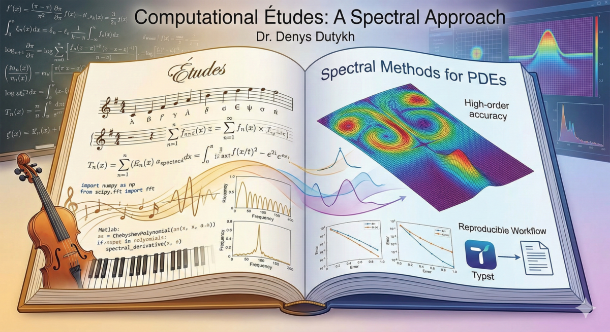

# Computational Études: Code Repository

This directory contains the Python, MATLAB, and Julia implementations accompanying the book *Computational Études: A Spectral Approach* by Dr. Denys Dutykh.



## Directory Structure

```
codes/
├── python/
│   ├── ch02/                           # Chapter 2: Classical PDEs
│   │   ├── heat_equation_evolution.py  # Heat equation time evolution
│   │   ├── heat_equation_waterfall.py  # Heat equation 3D waterfall plot
│   │   ├── wave_equation_evolution.py  # Wave equation oscillations
│   │   ├── wave_equation_waterfall.py  # Wave equation 3D waterfall plot
│   │   └── laplace_equation_2d.py      # Laplace equation in 2D strip
│   ├── ch03/                           # Chapter 3: Mise en Bouche
│   │   ├── collocation_example1.py     # Three-coefficient collocation example
│   │   └── collocation_vs_galerkin.py  # Comparison of collocation and Galerkin methods
│   ├── ch04/                           # Chapter 4: The Geometry of Nodes
│   │   ├── runge_phenomenon.py         # Runge phenomenon visualization
│   │   ├── chebyshev_success.py        # Chebyshev interpolation success
│   │   ├── chebyshev_points_circle.py  # Geometric construction of Chebyshev points
│   │   ├── equipotential_curves.py     # Potential theory equipotential curves
│   │   ├── lagrange_basis.py           # Lagrange basis functions comparison
│   │   ├── lebesgue_functions.py       # Lebesgue functions and constants
│   │   ├── convergence_comparison.py   # Convergence rate comparison
│   │   ├── convergence_zoom.py         # Convergence detail view
│   │   ├── lebesgue_constants_zoom.py  # Lebesgue constants detail view
│   │   ├── lebesgue_random_nodes.py    # Lebesgue functions for random nodes
│   │   └── lebesgue_random_chebyshev.py # Lebesgue functions: random vs Chebyshev
│   ├── ch05/                           # Chapter 5: Differentiation Matrices
│   │   ├── fdweights.py                # Fornberg's algorithm for FD weights
│   │   ├── spectral_matrix_periodic.py # Periodic spectral differentiation matrix
│   │   ├── fd_matrix_bandwidth.py      # FD matrix sparsity visualization
│   │   ├── spectral_matrix_structure.py # Spectral matrix structure visualization
│   │   ├── stencil_pyramid.py          # Fornberg recursion pyramid diagram
│   │   ├── periodic_cardinal_functions.py # Periodic cardinal function visualization
│   │   ├── spectral_derivatives_demo.py # Spectral differentiation demonstration
│   │   ├── higher_order_derivatives.py # Higher-order derivatives (up to 4th)
│   │   └── convergence_comparison.py   # FD vs spectral convergence comparison
│   ├── ch06/                           # Chapter 6: Smoothness and Spectral Accuracy
│   │   ├── fourier_decay.py            # Fourier coefficient decay rates
│   │   ├── aliasing_demo.py            # Aliasing phenomenon demonstration
│   │   ├── convergence_rates.py        # Spectral convergence rate analysis
│   │   └── harmonic_oscillator.py      # Quantum harmonic oscillator eigenvalues
│   ├── ch07/                           # Chapter 7: Chebyshev Differentiation
│   │   ├── cheb_matrix.py              # Chebyshev differentiation matrix construction
│   │   ├── cheb_diff_demo.py           # Chebyshev differentiation demonstration
│   │   ├── cheb_convergence.py         # Convergence analysis (waterfall plot)
│   │   ├── cheb_grid_comparison.py     # Periodic vs Chebyshev grid comparison
│   │   ├── cheb_matrix_structure.py    # Chebyshev matrix structure visualization
│   │   └── cheb_cardinal.py            # Chebyshev cardinal function visualization
│   ├── ch08/                           # Chapter 8: Boundary Value Problems
│   │   ├── bvp_linear.py               # 1D Poisson equation with spectral collocation
│   │   ├── bvp_variable_coeff.py       # Variable coefficient BVP
│   │   ├── bvp_eigenvalue.py           # Eigenvalue problems (quantum harmonic oscillator)
│   │   ├── bvp_2d_poisson.py           # 2D Poisson equation with tensor product grids
│   │   ├── bvp_helmholtz.py            # Helmholtz equation
│   │   └── bvp_nonlinear.py            # Nonlinear BVP (Bratu equation)
│   ├── ch09/                           # Chapter 9: Physical and Fourier Space on Grids
│   │   ├── two_views_function.py       # Physical vs Fourier space visualization
│   │   ├── aliasing_demo.py            # Aliasing of sin(πx) and sin(9πx)
│   │   ├── sinc_interpolation.py       # Band-limited sinc interpolation
│   │   ├── fft_aliasing.py             # FFT aliasing demonstration
│   │   ├── smoothness_spectra.py       # Smoothness vs Fourier decay rates
│   │   └── zero_padding_interpolation.py # Zero-padding interpolation via FFT
│   ├── ch10/                           # Chapter 10: Spectral PDE Solvers
│   │   ├── chebfft.py                  # Chebyshev differentiation via FFT
│   │   ├── cheb_fourier_geometry.py    # Chebyshev-Fourier geometry visualization
│   │   ├── chebfft_accuracy.py         # chebfft spectral accuracy demonstration
│   │   ├── wave1d_cheb.py              # 1D wave equation on Chebyshev grid
│   │   ├── wave2d_cheb.py              # 2D wave equation on tensor grid
│   │   ├── heat1d_cheb.py              # 1D heat equation with Crank--Nicolson
│   │   ├── heat2d_cheb.py              # 2D heat equation with backward Euler
│   │   ├── poisson2d_cheb.py           # 2D Poisson equation solver
│   │   └── transport_variable.py       # Variable coefficient transport equation
│   ├── ch11/                           # Chapter 11: Fourier Pseudospectral Methods
│   │   ├── fourier_diff_comparison.py  # Fourier differentiation accuracy and timing
│   │   ├── advection_fourier.py        # Linear advection with Fourier spectral method
│   │   ├── burgers_fourier.py          # Burgers equation with dealiasing
│   │   ├── kdv_soliton.py              # KdV single soliton propagation
│   │   ├── kdv_zabusky_kruskal.py      # KdV Zabusky--Kruskal recurrence experiment
│   │   ├── allen_cahn.py               # Allen--Cahn phase separation equation
│   │   ├── schrodinger.py              # Linear Schrödinger equation
│   │   ├── nls_recurrence.py           # Nonlinear Schrödinger recurrence
│   │   ├── kuramoto_sivashinsky.py     # Kuramoto--Sivashinsky chaotic dynamics
│   │   ├── navier_stokes_2d.py         # 2D Navier--Stokes vorticity-streamfunction
│   │   └── transport_variable.py       # Variable coefficient transport equation
│   ├── ch12/                           # Chapter 12: Polar Coordinates
│   │   ├── laplacian_polar.py          # Polar Laplacian assembly (helper)
│   │   ├── polar_grid_geometry.py      # Polar grid geometry visualization
│   │   ├── disk_eigenmodes.py          # Disk Laplacian eigenmodes (Bessel zeros)
│   │   ├── disk_nodal_rotation.py      # Nodal line rotation démonstration
│   │   ├── disk_poisson.py             # Poisson equation on the unit disk
│   │   └── disk_heat.py                # Heat equation on the unit disk
│   ├── ch13/                           # Chapter 13: Advanced Boundary Conditions
│   │   ├── bc_inhom_lifting.py         # Inhomogeneous Poisson with lifting (Method I)
│   │   ├── bc_helmholtz_robin.py       # Helmholtz equation with Robin BCs (Method II)
│   │   ├── bc_allen_cahn.py            # Allen--Cahn with fixed and driven boundaries
│   │   ├── bc_radiative.py             # Radiative cooling (nonlinear BC, Newton)
│   │   ├── bc_laplace_2d.py            # 2D Laplace with piecewise boundary data
│   │   ├── bc_qnm_poschl_teller.py    # Quasinormal modes via quadratic eigenvalue problem
│   │   └── bc_vibrating_string.py      # Vibrating string with free end (mixed BCs)
│   ├── ch14/                           # Chapter 14: Higher-Order Boundary Value Problems
│   │   ├── ho_clamped_beam.py          # Clamped beam u⁽⁴⁾ = eˣ (polynomial trick)
│   │   ├── ho_beam_eigenmodes.py       # Vibration modes of a clamped beam
│   │   ├── ho_coupled_comparison.py    # Direct D⁴ vs coupled D² system comparison
│   │   ├── ho_plate_eigenmodes.py      # Eigenmodes of a clamped square plate
│   │   ├── ho_quarter_plate.py         # Quarter-plate symmetry reduction
│   │   ├── ho_orr_sommerfeld.py        # Orr--Sommerfeld spectrum at R = 5772
│   │   ├── ho_pseudospectra.py         # Pseudospectra of Orr--Sommerfeld operator
│   │   └── ho_kuramoto_sivashinsky.py  # Kuramoto--Sivashinsky with ETDRK4
│   ├── ch15/                           # Chapter 15: Quadrature in Spectral Methods
│   │   ├── quad_node_visualization.py   # Node distributions (Newton--Cotes, Gauss, CC)
│   │   ├── quad_polynomial_exactness.py # Polynomial exactness test (16.1)
│   │   ├── quad_newton_cotes_runge.py   # Newton--Cotes failure on the Runge function
│   │   ├── quad_exactness_table.py      # Monomial vs Chebyshev exactness comparison
│   │   ├── quad_gauss_cc_construction.py # Golub--Welsch and FFT-based CC construction
│   │   ├── quad_convergence_race.py     # Six-function convergence race (Gauss vs CC)
│   │   ├── quad_aliasing_chebyshev.py   # Chebyshev aliasing visualization
│   │   ├── quad_complex_plane.py        # Complex-plane error portraits
│   │   ├── quad_gauss_hermite_weights.py # Gauss--Hermite wasted weights
│   │   ├── quad_gauss_hermite_failure.py # Gauss--Hermite vs truncation comparison
│   │   └── quad_convergence_rates.py    # Experimental convergence rate verification
│   ├── ch16/                           # Chapter 16: Integration of Periodic Functions
│   │   ├── trap_poisson_ellipse.py     # Poisson's ellipse: the original paradox
│   │   ├── trap_band_limited.py        # Band-limited exactness and aliasing
│   │   ├── trap_algebraic_decay.py     # Algebraic decay on |sin(x/2)|^k
│   │   ├── trap_poisson_kernel.py      # Geometric decay on the Poisson kernel
│   │   ├── trap_supergeometric.py      # Supergeometric decay on e^cos(x)
│   │   ├── trap_subgeometric.py        # Subgeometric decay on Weideman's f_6
│   │   ├── trap_real_line.py           # Real-line trapezoidal rule on Gaussian
│   │   └── trap_fft_coefficients.py    # FFT computation of Fourier coefficients
│   ├── ch17/                           # Chapter 17: Time Stepping and CFL Constraint
│   │   ├── catastrophe_gallery.py      # Three deliberate blow-ups
│   │   ├── stability_regions.py        # Stability regions of 6 classical integrators
│   │   ├── fourier_cfl.py              # Fourier CFL scaling for constant coefficients
│   │   ├── fourier_cfl_variable.py     # Frozen-coefficient CFL for variable speed
│   │   ├── chebyshev_stiffness.py      # Chebyshev D² eigenvalues and outliers
│   │   ├── pseudospectra_demo.py       # Pseudospectra: normal vs nonnormal
│   │   ├── fair_comparison.py          # Six time-stepping cures compared
│   │   └── kdv_rk_comparison.py        # Plain RK4 vs integrating-factor RK4
│   ├── ch18/                           # Chapter 18: Linear Spectral Eigenproblems
│   │   ├── spectrum_verify.py          # Drift-with-N diagnostic (shared utility)
│   │   ├── rational_chebyshev.py       # TB_n basis on (-inf, inf) via algebraic map (shared utility)
│   │   ├── rational_chebyshev_map.py   # Mapping helpers between TB_n and physical variables
│   │   ├── heinrichs_basis.py          # (1-x^2)^m T_j boundary-adapted basis (shared utility)
│   │   ├── eigen_smooth_lie.py         # Etude 18.1: the smooth lie (Boyd Fig 7.2)
│   │   ├── eigen_two_formulations.py   # Etude 18.2: pencil vs. basis-recombined
│   │   ├── eigen_benchmark_finite.py   # Etude 18.3: finite-interval N/2 rule (Boyd Figs 7.1, 7.3)
│   │   ├── eigen_benchmark_oscillator.py # Etude 18.4: infinite-interval tax (Boyd Figs 7.4, 7.6)
│   │   ├── eigen_drift_diagnostic.py   # Etude 18.5: spectrum lie detector (Boyd Fig 7.7)
│   │   ├── eigen_bound_plus_continuum.py # Etude 18.6: Pöschl-Teller bound states + continuum
│   │   ├── eigen_physically_spurious.py # Etude 18.7: Gottlieb-Orszag spurious modes
│   │   ├── eigen_heinrichs_condition.py # Etude 18.8: condition-number surgery (Boyd Fig 7.9)
│   │   ├── eigen_power_inverse.py      # Etude 18.9: power and inverse iteration
│   │   ├── eigen_parameter_map.py      # Etude 18.10: safe parameter-space mapping
│   │   └── eigen_complex_detour.py     # Etude 18.11: complex-plane detour (Boyd Fig 7.12)
│   ├── ch19/                           # Chapter 19: Coordinate Transformations and Mapped Spectral Methods
│   │   ├── map_common.py               # Shared 1D-map utilities (helper)
│   │   ├── map1d_toolkit.py            # Reusable mapping toolkit (helper)
│   │   ├── periodic_pulse_two_grids.py # Étude 19.1: a periodic pulse on uniform vs mapped grid
│   │   ├── arctan_tan_map.py           # Period-2π arctan/tan map and its image grid
│   │   ├── arctan_tan_sweep.py         # Width-parameter ℓ sweep for the arctan/tan map
│   │   ├── chebyshev_as_cosine.py      # Chebyshev arithmetic via t = arccos(x)
│   │   ├── semi_infinite_compare.py    # Algebraic vs logarithmic maps on a semi-infinite domain
│   │   ├── heal_branch_point.py        # Tanh map healing a weak endpoint singularity
│   │   ├── kosloff_tal_ezer.py         # Almost-equispaced KTE grid: timestep vs accuracy
│   │   └── corner_tensor_clustering.py # Tensor-product corner clustering on the unit square
│   ├── ch20/                           # Chapter 20: Spectral Methods on Unbounded Intervals
│   │   ├── unbounded_common.py         # Shared utilities for unbounded-interval bases (helper)
│   │   ├── truncation_stalls.py        # Étude 20.1: when Chebyshev truncation stalls
│   │   ├── fourier_vs_chebyshev_truncation.py # Periodic vs Chebyshev truncation on infinite line
│   │   ├── sinc_two_masters.py         # Sinc functions and the two trapezoidal masters
│   │   ├── hermite_width_mismatch.py   # Hermite width-mismatch tax
│   │   ├── behavioral_bc_laguerre.py   # Behavioural BCs at infinity via Laguerre
│   │   ├── laguerre_vs_tln.py          # Laguerre vs rational Chebyshev T L_n on [0,∞)
│   │   ├── tbn_humiliates_hermite.py   # Rational Chebyshev T B_n humiliates Hermite on algebraic tails
│   │   ├── tln_map_illustration.py     # Map underlying T L_n on the half-line
│   │   ├── weideman_cloot_map.py       # Weideman--Cloot sinh mapping
│   │   ├── rK1_composed_map.py         # Composed map for oscillatory tails
│   │   ├── ell_diagnostic.py           # Coefficient-decay (ℓ) diagnostic for tuning scale parameters
│   │   ├── J0_oscillatory.py           # Amplitude--phase split for √(1+y) J_0(y)
│   │   └── yoshida_jet.py              # Yoshida jet: oscillatory tail with slow envelope
│   └── ch21/                           # Chapter 21 (bonus): Special Tricks for the Spectral Researcher
│       ├── tricks_common.py            # Shared utilities for the special-tricks chapter (helper)
│       ├── rescue_naive_vs_tailored.py # Étude 21.1: a rescue story in miniature (truncation length)
│       ├── mathieu_sideband.py         # Sideband truncation for the Mathieu equation
│       ├── singularity_subtraction.py  # Singularity subtraction with a tailored remainder
│       ├── crossover_truncation.py     # Crossover truncation: smooth bulk + algebraic tail
│       ├── radiation_scattering.py     # Radiation basis functions for scattering with plane waves
│       ├── ioakimidis_root.py          # Chebyshev surrogate + colleague-matrix root-finding (Ioakimidis)
│       ├── hilbert_fourier.py          # Hilbert transform of an analytic periodic function via FFT
│       ├── symbolic_quartic_oscillator.py # Symbolic small-N: nonlinear width parameter
│       ├── symbolic_boundary_layer.py  # Symbolic small-N treatment of a boundary layer
│       ├── lanczos_economization.py    # Lanczos economization (symbolic τ-method warm-up)
│       └── tau_first_order.py          # Lanczos τ-method on a first-order ODE
├── matlab/
│   ├── ch02/
│   │   ├── heat_equation_evolution.m
│   │   ├── heat_equation_waterfall.m
│   │   ├── wave_equation_evolution.m
│   │   ├── wave_equation_waterfall.m
│   │   └── laplace_equation_2d.m
│   ├── ch03/
│   │   ├── collocation_example1.m
│   │   └── collocation_vs_galerkin.m
│   ├── ch04/
│   │   ├── runge_phenomenon.m
│   │   ├── chebyshev_success.m
│   │   ├── chebyshev_points_circle.m
│   │   ├── equipotential_curves.m
│   │   ├── lagrange_basis.m
│   │   ├── lebesgue_functions.m
│   │   ├── convergence_comparison.m
│   │   ├── convergence_zoom.m           # Convergence detail view
│   │   └── lebesgue_constants_zoom.m    # Lebesgue constants detail view
│   ├── ch05/
│   │   ├── fdweights.m                 # Fornberg's algorithm for FD weights
│   │   ├── fd_matrix_periodic.m        # Periodic FD matrix construction
│   │   ├── spectral_matrix_periodic.m  # Periodic spectral differentiation matrix
│   │   ├── fd_matrix_bandwidth.m       # FD matrix sparsity visualization
│   │   ├── spectral_matrix_structure.m # Spectral matrix structure visualization
│   │   ├── stencil_pyramid.m           # Fornberg recursion pyramid diagram
│   │   ├── periodic_cardinal_functions.m # Periodic cardinal function visualization
│   │   ├── spectral_derivatives_demo.m # Spectral differentiation demonstration
│   │   ├── higher_order_derivatives.m  # Higher-order derivatives (up to 4th)
│   │   └── convergence_comparison.m    # FD vs spectral convergence comparison
│   ├── ch06/
│   │   ├── fourier_decay.m             # Fourier coefficient decay rates
│   │   ├── aliasing_demo.m             # Aliasing phenomenon demonstration
│   │   ├── convergence_rates.m         # Spectral convergence rate analysis
│   │   └── harmonic_oscillator.m       # Quantum harmonic oscillator eigenvalues
│   ├── ch07/
│   │   ├── cheb_matrix.m               # Chebyshev differentiation matrix construction
│   │   ├── verify_cheb_matrix.m        # Verification of Chebyshev matrix accuracy
│   │   ├── cheb_grid_comparison.m      # Equispaced vs Chebyshev grid comparison
│   │   ├── cheb_matrix_structure.m     # Matrix heatmap and row profiles
│   │   ├── cheb_cardinal.m             # Cardinal functions visualization
│   │   ├── cheb_diff_demo.m            # Differentiation demo with Witch of Agnesi
│   │   └── cheb_convergence.m          # Convergence rates for test functions
│   ├── ch08/
│   │   ├── bvp_linear.m                # 1D Poisson equation solver
│   │   ├── bvp_variable_coeff.m        # Variable coefficient BVP
│   │   ├── bvp_eigenvalue.m            # Eigenvalue problem solver
│   │   ├── bvp_2d_poisson.m            # 2D Poisson with tensor product grids
│   │   ├── bvp_helmholtz.m             # Helmholtz equation near resonance
│   │   └── bvp_nonlinear.m             # Bratu equation with Newton iteration
│   ├── ch09/
│   │   ├── two_views_function.m        # Physical vs Fourier space visualization
│   │   ├── aliasing_demo.m             # Aliasing of sin(πx) and sin(9πx)
│   │   ├── sinc_interpolation.m        # Band-limited sinc interpolation
│   │   ├── fft_aliasing.m              # FFT aliasing demonstration
│   │   ├── smoothness_spectra.m        # Smoothness vs Fourier decay rates
│   │   └── zero_padding_interpolation.m # Zero-padding interpolation via FFT
│   ├── ch10/
│   │   ├── chebfft.m                   # Chebyshev differentiation via FFT
│   │   ├── cheb_matrix.m               # Chebyshev differentiation matrix
│   │   ├── cheb_fourier_geometry.m     # Chebyshev-Fourier geometry visualization
│   │   ├── chebfft_accuracy.m          # chebfft spectral accuracy demonstration
│   │   ├── wave1d_cheb.m               # 1D wave equation on Chebyshev grid
│   │   ├── wave2d_cheb.m               # 2D wave equation on tensor grid
│   │   ├── heat1d_cheb.m               # 1D heat equation with Crank--Nicolson
│   │   ├── heat2d_cheb.m               # 2D heat equation with backward Euler
│   │   ├── poisson2d_cheb.m            # 2D Poisson equation solver
│   │   └── transport_variable.m        # Variable coefficient transport equation
│   ├── ch11/                           # Chapter 11: Fourier Pseudospectral Methods
│   │   ├── fourier_diff_comparison.m   # Fourier differentiation accuracy and timing
│   │   ├── advection_fourier.m         # Linear advection with Fourier spectral method
│   │   ├── burgers_fourier.m           # Burgers equation with dealiasing
│   │   ├── kdv_soliton.m               # KdV single soliton propagation
│   │   ├── kdv_zabusky_kruskal.m       # KdV Zabusky--Kruskal recurrence experiment
│   │   ├── allen_cahn.m                # Allen--Cahn phase separation equation
│   │   ├── schrodinger.m               # Linear Schrödinger equation
│   │   ├── nls_recurrence.m            # Nonlinear Schrödinger recurrence
│   │   ├── kuramoto_sivashinsky.m      # Kuramoto--Sivashinsky chaotic dynamics
│   │   ├── navier_stokes_2d.m          # 2D Navier--Stokes vorticity-streamfunction
│   │   └── transport_variable.m        # Variable coefficient transport equation
│   ├── ch12/                           # Chapter 12: Polar Coordinates
│   │   ├── laplacian_polar.m           # Polar Laplacian assembly (helper)
│   │   ├── polar_grid_geometry.m       # Polar grid geometry visualization
│   │   ├── disk_eigenmodes.m           # Disk Laplacian eigenmodes (Bessel zeros)
│   │   ├── disk_nodal_rotation.m       # Nodal line rotation demonstration
│   │   ├── disk_poisson.m              # Poisson equation on the unit disk
│   │   └── disk_heat.m                 # Heat equation on the unit disk
│   ├── ch13/                           # Chapter 13: Advanced Boundary Conditions
│   │   ├── bc_inhom_lifting.m          # Inhomogeneous Poisson with lifting (Method I)
│   │   ├── bc_helmholtz_robin.m        # Helmholtz equation with Robin BCs (Method II)
│   │   ├── bc_allen_cahn.m             # Allen--Cahn with fixed and driven boundaries
│   │   ├── bc_radiative.m              # Radiative cooling (nonlinear BC, Newton)
│   │   ├── bc_laplace_2d.m             # 2D Laplace with piecewise boundary data
│   │   ├── bc_qnm_poschl_teller.m     # Quasinormal modes via quadratic eigenvalue problem
│   │   └── bc_vibrating_string.m       # Vibrating string with free end (mixed BCs)
│   ├── ch14/                           # Chapter 14: Higher-Order Boundary Value Problems
│   │   ├── ho_clamped_beam.m           # Clamped beam u⁽⁴⁾ = eˣ (polynomial trick)
│   │   ├── ho_beam_eigenmodes.m        # Vibration modes of a clamped beam
│   │   ├── ho_coupled_comparison.m     # Direct D⁴ vs coupled D² system comparison
│   │   ├── ho_plate_eigenmodes.m       # Eigenmodes of a clamped square plate
│   │   ├── ho_quarter_plate.m          # Quarter-plate symmetry reduction
│   │   ├── ho_orr_sommerfeld.m         # Orr--Sommerfeld spectrum at R = 5772
│   │   ├── ho_pseudospectra.m          # Pseudospectra of Orr--Sommerfeld operator
│   │   └── ho_kuramoto_sivashinsky.m   # Kuramoto--Sivashinsky with ETDRK4
│   ├── ch15/                           # Chapter 15: Quadrature in Spectral Methods
│   │   ├── quad_node_visualization.m    # Node distributions (Newton--Cotes, Gauss, CC)
│   │   ├── quad_polynomial_exactness.m  # Polynomial exactness test (15.1)
│   │   ├── quad_newton_cotes_runge.m    # Newton--Cotes failure on the Runge function
│   │   ├── quad_exactness_table.m       # Monomial vs Chebyshev exactness comparison
│   │   ├── quad_gauss_cc_construction.m # Golub--Welsch and FFT-based CC construction
│   │   ├── quad_convergence_race.m      # Six-function convergence race (Gauss vs CC)
│   │   ├── quad_aliasing_chebyshev.m    # Chebyshev aliasing visualization
│   │   ├── quad_complex_plane.m         # Complex-plane error portraits
│   │   ├── quad_gauss_hermite_weights.m # Gauss--Hermite wasted weights
│   │   ├── quad_gauss_hermite_failure.m # Gauss--Hermite vs truncation comparison
│   │   └── quad_convergence_rates.m     # Experimental convergence rate verification
│   ├── ch16/                           # Chapter 16: Integration of Periodic Functions
│   │   ├── trap_poisson_ellipse.m      # Poisson's ellipse: the original paradox
│   │   ├── trap_band_limited.m         # Band-limited exactness and aliasing
│   │   ├── trap_algebraic_decay.m      # Algebraic decay on |sin(x/2)|^k
│   │   ├── trap_poisson_kernel.m       # Geometric decay on the Poisson kernel
│   │   ├── trap_supergeometric.m       # Supergeometric decay on e^cos(x)
│   │   ├── trap_subgeometric.m         # Subgeometric decay on Weideman's f_6
│   │   ├── trap_real_line.m            # Real-line trapezoidal rule on Gaussian
│   │   └── trap_fft_coefficients.m     # FFT computation of Fourier coefficients
│   ├── ch17/                           # Chapter 17: Time Stepping and CFL Constraint
│   │   ├── catastrophe_gallery.m       # Three deliberate blow-ups
│   │   ├── stability_regions.m         # Stability regions of 6 classical integrators
│   │   ├── fourier_cfl.m               # Fourier CFL scaling for constant coefficients
│   │   ├── fourier_cfl_variable.m      # Frozen-coefficient CFL for variable speed
│   │   ├── chebyshev_stiffness.m       # Chebyshev D² eigenvalues and outliers
│   │   ├── pseudospectra_demo.m        # Pseudospectra: normal vs nonnormal
│   │   ├── fair_comparison.m           # Six time-stepping cures compared
│   │   └── kdv_rk_comparison.m         # Plain RK4 vs integrating-factor RK4
│   ├── ch18/                           # Chapter 18: Linear Spectral Eigenproblems
│   │   ├── spectrum_verify.m           # Drift-with-N diagnostic (shared utility)
│   │   ├── rational_chebyshev.m        # TB_n basis on (-inf, inf) via algebraic map (shared utility)
│   │   ├── rational_chebyshev_map.m    # Mapping helpers between TB_n and physical variables
│   │   ├── heinrichs_basis.m           # (1-x^2)^m T_j boundary-adapted basis (shared utility)
│   │   ├── eigen_smooth_lie.m          # Etude 18.1: the smooth lie (Boyd Fig 7.2)
│   │   ├── eigen_two_formulations.m    # Etude 18.2: pencil vs. basis-recombined
│   │   ├── eigen_benchmark_finite.m    # Etude 18.3: finite-interval N/2 rule (Boyd Figs 7.1, 7.3)
│   │   ├── eigen_benchmark_oscillator.m  # Etude 18.4: infinite-interval tax (Boyd Figs 7.4, 7.6)
│   │   ├── eigen_drift_diagnostic.m    # Etude 18.5: spectrum lie detector (Boyd Fig 7.7)
│   │   ├── eigen_bound_plus_continuum.m # Etude 18.6: Pöschl-Teller bound states + continuum
│   │   ├── eigen_physically_spurious.m # Etude 18.7: Gottlieb-Orszag spurious modes
│   │   ├── eigen_heinrichs_condition.m # Etude 18.8: condition-number surgery (Boyd Fig 7.9)
│   │   ├── eigen_power_inverse.m       # Etude 18.9: power and inverse iteration
│   │   ├── eigen_parameter_map.m       # Etude 18.10: safe parameter-space mapping
│   │   └── eigen_complex_detour.m      # Etude 18.11: complex-plane detour (Boyd Fig 7.12)
│   ├── ch19/                           # Chapter 19: Coordinate Transformations and Mapped Spectral Methods
│   │   ├── map1d_toolkit.m             # Reusable mapping toolkit (helper)
│   │   ├── periodic_pulse_two_grids.m  # Étude 19.1: a periodic pulse on uniform vs mapped grid
│   │   ├── arctan_tan_map.m            # Period-2π arctan/tan map and its image grid
│   │   ├── arctan_tan_sweep.m          # Width-parameter ℓ sweep for the arctan/tan map
│   │   ├── chebyshev_as_cosine.m       # Chebyshev arithmetic via t = arccos(x)
│   │   ├── semi_infinite_compare.m     # Algebraic vs logarithmic maps on a semi-infinite domain
│   │   ├── heal_branch_point.m         # Tanh map healing a weak endpoint singularity
│   │   ├── kosloff_tal_ezer.m          # Almost-equispaced KTE grid: timestep vs accuracy
│   │   └── corner_tensor_clustering.m  # Tensor-product corner clustering on the unit square
│   ├── ch20/                           # Chapter 20: Spectral Methods on Unbounded Intervals
│   │   ├── truncation_stalls.m         # Étude 20.1: when Chebyshev truncation stalls
│   │   ├── fourier_vs_chebyshev_truncation.m # Periodic vs Chebyshev truncation on infinite line
│   │   ├── sinc_two_masters.m          # Sinc functions and the two trapezoidal masters
│   │   ├── hermite_width_mismatch.m    # Hermite width-mismatch tax
│   │   ├── behavioral_bc_laguerre.m    # Behavioural BCs at infinity via Laguerre
│   │   ├── laguerre_vs_tln.m           # Laguerre vs rational Chebyshev T L_n on [0,∞)
│   │   ├── tbn_humiliates_hermite.m    # Rational Chebyshev T B_n humiliates Hermite on algebraic tails
│   │   ├── tln_map_illustration.m      # Map underlying T L_n on the half-line
│   │   ├── weideman_cloot_map.m        # Weideman--Cloot sinh mapping
│   │   ├── rK1_composed_map.m          # Composed map for oscillatory tails
│   │   ├── ell_diagnostic.m            # Coefficient-decay (ℓ) diagnostic for tuning scale parameters
│   │   ├── J0_oscillatory.m            # Amplitude--phase split for √(1+y) J_0(y)
│   │   └── yoshida_jet.m               # Yoshida jet: oscillatory tail with slow envelope
│   └── ch21/                           # Chapter 21 (bonus): Special Tricks for the Spectral Researcher
│       ├── tricks_common.m             # Shared utilities for the special-tricks chapter (helper)
│       ├── rescue_naive_vs_tailored.m  # Étude 21.1: a rescue story in miniature (truncation length)
│       ├── mathieu_sideband.m          # Sideband truncation for the Mathieu equation
│       ├── singularity_subtraction.m   # Singularity subtraction with a tailored remainder
│       ├── crossover_truncation.m      # Crossover truncation: smooth bulk + algebraic tail
│       ├── radiation_scattering.m      # Radiation basis functions for scattering with plane waves
│       ├── ioakimidis_root.m           # Chebyshev surrogate + colleague-matrix root-finding (Ioakimidis)
│       ├── hilbert_fourier.m           # Hilbert transform of an analytic periodic function via FFT
│       ├── symbolic_quartic_oscillator.m # Symbolic small-N: nonlinear width parameter
│       ├── symbolic_boundary_layer.m   # Symbolic small-N treatment of a boundary layer
│       ├── lanczos_economization.m     # Lanczos economization (symbolic τ-method warm-up)
│       └── tau_first_order.m           # Lanczos τ-method on a first-order ODE
└── julia/
    ├── ch02/                           # Chapter 2: Classical PDEs
    │   ├── heat_equation_evolution.jl  # Heat equation time evolution
    │   ├── heat_equation_waterfall.jl  # Heat equation 3D waterfall plot
    │   ├── wave_equation_evolution.jl  # Wave equation oscillations
    │   ├── wave_equation_waterfall.jl  # Wave equation 3D waterfall plot
    │   └── laplace_equation_2d.jl      # Laplace equation in 2D strip
    ├── ch03/                           # Chapter 3: Mise en Bouche
    │   ├── collocation_example1.jl     # Three-coefficient collocation example
    │   └── collocation_vs_galerkin.jl  # Comparison of collocation and Galerkin methods
    ├── ch04/                           # Chapter 4: The Geometry of Nodes
    │   ├── runge_phenomenon.jl         # Runge phenomenon visualization
    │   ├── chebyshev_success.jl        # Chebyshev interpolation success
    │   ├── chebyshev_points_circle.jl  # Geometric construction of Chebyshev points
    │   ├── equipotential_curves.jl     # Potential theory equipotential curves
    │   ├── lagrange_basis.jl           # Lagrange basis functions comparison
    │   ├── lebesgue_functions.jl       # Lebesgue functions and constants
    │   ├── lebesgue_constants_zoom.jl  # Lebesgue constants detail view
    │   ├── lebesgue_random_nodes.jl    # Lebesgue functions for random nodes
    │   ├── convergence_comparison.jl   # Convergence rate comparison
    │   └── convergence_zoom.jl         # Convergence detail view
    ├── ch05/                           # Chapter 5: Differentiation Matrices
    │   ├── fdweights.jl                # Fornberg's algorithm for FD weights
    │   ├── fd_matrix_bandwidth.jl      # FD matrix sparsity visualization
    │   ├── spectral_matrix_structure.jl # Spectral matrix structure visualization
    │   ├── fd_stencil_schematic.jl     # FD stencil schematic diagram
    │   ├── stencil_pyramid.jl          # Fornberg recursion pyramid diagram
    │   ├── spectral_derivatives_demo.jl # Spectral differentiation demonstration
    │   └── convergence_comparison.jl   # FD vs spectral convergence comparison
    ├── ch06/                           # Chapter 6: Smoothness and Spectral Accuracy
    │   ├── fourier_decay.jl            # Fourier coefficient decay rates
    │   ├── aliasing_demo.jl            # Aliasing phenomenon demonstration
    │   └── convergence_rates.jl        # Spectral convergence rate analysis
    ├── ch07/                           # Chapter 7: Chebyshev Differentiation
    │   ├── cheb_matrix.jl              # Chebyshev differentiation matrix construction
    │   ├── cheb_grid_comparison.jl     # Equispaced vs Chebyshev grid comparison
    │   ├── cheb_matrix_structure.jl    # Matrix heatmap and row profiles
    │   ├── cheb_cardinal.jl            # Cardinal functions visualization
    │   ├── cheb_diff_demo.jl           # Differentiation demo with Witch of Agnesi
    │   └── cheb_convergence.jl         # Convergence rates for test functions
    ├── ch08/                           # Chapter 8: Boundary Value Problems
    │   ├── bvp_linear.jl               # 1D Poisson equation with spectral collocation
    │   ├── bvp_variable_coeff.jl       # Variable coefficient BVP
    │   ├── bvp_nonlinear.jl            # Nonlinear BVP (Bratu equation)
    │   ├── bvp_eigenvalue.jl           # Eigenvalue problems
    │   ├── bvp_2d_poisson.jl           # 2D Poisson equation with tensor product grids
    │   ├── bvp_helmholtz.jl            # Helmholtz equation
    │   └── harmonic_oscillator.jl      # Quantum harmonic oscillator
    ├── ch09/                           # Chapter 9: Physical and Fourier Space on Grids
    │   ├── two_views_function.jl       # Physical vs Fourier space visualization
    │   ├── aliasing_demo.jl            # Aliasing of sin(πx) and sin(9πx)
    │   ├── sinc_interpolation.jl       # Band-limited sinc interpolation
    │   ├── fft_aliasing.jl             # FFT aliasing demonstration
    │   ├── smoothness_spectra.jl       # Smoothness vs Fourier decay rates
    │   └── zero_padding_interpolation.jl # Zero-padding interpolation via FFT
    ├── ch10/                           # Chapter 10: Spectral PDE Solvers
    │   ├── chebfft.jl                  # Chebyshev differentiation via FFT
    │   ├── cheb_fourier_geometry.jl    # Chebyshev-Fourier geometry visualization
    │   ├── chebfft_accuracy.jl         # chebfft spectral accuracy demonstration
    │   ├── wave1d_cheb.jl              # 1D wave equation on Chebyshev grid
    │   ├── wave2d_cheb.jl              # 2D wave equation on tensor grid
    │   ├── heat1d_cheb.jl              # 1D heat equation with Crank--Nicolson
    │   ├── heat2d_cheb.jl              # 2D heat equation with backward Euler
    │   ├── poisson2d_cheb.jl           # 2D Poisson equation solver
    │   └── transport_variable.jl       # Variable coefficient transport equation
    ├── ch11/                           # Chapter 11: Fourier Pseudospectral Methods
    │   ├── fourier_diff_comparison.jl  # Fourier differentiation accuracy and timing
    │   ├── advection_fourier.jl        # Linear advection with Fourier spectral method
    │   ├── burgers_fourier.jl          # Burgers equation with dealiasing
    │   ├── kdv_soliton.jl              # KdV single soliton propagation
    │   ├── kdv_zabusky_kruskal.jl      # KdV Zabusky--Kruskal recurrence experiment
    │   ├── allen_cahn.jl               # Allen--Cahn phase separation equation
    │   ├── schrodinger.jl              # Linear Schrödinger equation
    │   ├── nls_recurrence.jl           # Nonlinear Schrödinger recurrence
    │   ├── kuramoto_sivashinsky.jl     # Kuramoto--Sivashinsky chaotic dynamics
    │   ├── navier_stokes_2d.jl         # 2D Navier--Stokes vorticity-streamfunction
    │   └── transport_variable.jl       # Variable coefficient transport equation
    ├── ch12/                           # Chapter 12: Polar Coordinates
    │   ├── laplacian_polar.jl          # Polar Laplacian assembly (helper)
    │   ├── polar_grid_geometry.jl      # Polar grid geometry visualization
    │   ├── disk_eigenmodes.jl          # Disk Laplacian eigenmodes (Bessel zeros)
    │   ├── disk_nodal_rotation.jl      # Nodal line rotation demonstration
    │   ├── disk_poisson.jl             # Poisson equation on the unit disk
    │   └── disk_heat.jl               # Heat equation on the unit disk
    ├── ch13/                           # Chapter 13: Advanced Boundary Conditions
    │   ├── bc_inhom_lifting.jl         # Inhomogeneous Poisson with lifting (Method I)
    │   ├── bc_helmholtz_robin.jl       # Helmholtz equation with Robin BCs (Method II)
    │   ├── bc_allen_cahn.jl            # Allen--Cahn with fixed and driven boundaries
    │   ├── bc_radiative.jl             # Radiative cooling (nonlinear BC, Newton)
    │   ├── bc_laplace_2d.jl            # 2D Laplace with piecewise boundary data
    │   ├── bc_qnm_poschl_teller.jl    # Quasinormal modes via quadratic eigenvalue problem
    │   └── bc_vibrating_string.jl      # Vibrating string with free end (mixed BCs)
    ├── ch14/                           # Chapter 14: Higher-Order Boundary Value Problems
    │   ├── ho_clamped_beam.jl          # Clamped beam u⁽⁴⁾ = eˣ (polynomial trick)
    │   ├── ho_beam_eigenmodes.jl       # Vibration modes of a clamped beam
    │   ├── ho_coupled_comparison.jl    # Direct D⁴ vs coupled D² system comparison
    │   ├── ho_plate_eigenmodes.jl      # Eigenmodes of a clamped square plate
    │   ├── ho_quarter_plate.jl         # Quarter-plate symmetry reduction
    │   ├── ho_orr_sommerfeld.jl        # Orr--Sommerfeld spectrum at R = 5772
    │   ├── ho_pseudospectra.jl         # Pseudospectra of Orr--Sommerfeld operator
    │   └── ho_kuramoto_sivashinsky.jl  # Kuramoto--Sivashinsky with ETDRK4
    ├── ch15/                           # Chapter 15: Quadrature in Spectral Methods
    │   ├── quad_node_visualization.jl   # Node distributions (Newton--Cotes, Gauss, CC)
    │   ├── quad_polynomial_exactness.jl # Polynomial exactness test (15.1)
    │   ├── quad_newton_cotes_runge.jl   # Newton--Cotes failure on the Runge function
    │   ├── quad_exactness_table.jl      # Monomial vs Chebyshev exactness comparison
    │   ├── quad_gauss_cc_construction.jl # Golub--Welsch and FFT-based CC construction
    │   ├── quad_convergence_race.jl     # Six-function convergence race (Gauss vs CC)
    │   ├── quad_aliasing_chebyshev.jl   # Chebyshev aliasing visualization
    │   ├── quad_complex_plane.jl        # Complex-plane error portraits
    │   ├── quad_gauss_hermite_weights.jl # Gauss--Hermite wasted weights
    │   ├── quad_gauss_hermite_failure.jl # Gauss--Hermite vs truncation comparison
    │   └── quad_convergence_rates.jl    # Experimental convergence rate verification
    ├── ch16/                           # Chapter 16: Integration of Periodic Functions
    │   ├── trap_poisson_ellipse.jl     # Poisson's ellipse: the original paradox
    │   ├── trap_band_limited.jl        # Band-limited exactness and aliasing
    │   ├── trap_algebraic_decay.jl     # Algebraic decay on |sin(x/2)|^k
    │   ├── trap_poisson_kernel.jl      # Geometric decay on the Poisson kernel
    │   ├── trap_supergeometric.jl      # Supergeometric decay on e^cos(x)
    │   ├── trap_subgeometric.jl        # Subgeometric decay on Weideman's f_6
    │   ├── trap_real_line.jl           # Real-line trapezoidal rule on Gaussian
    │   └── trap_fft_coefficients.jl    # FFT computation of Fourier coefficients
    ├── ch17/                           # Chapter 17: Time Stepping and CFL Constraint
    │   ├── catastrophe_gallery.jl      # Three deliberate blow-ups
    │   ├── stability_regions.jl        # Stability regions of 6 classical integrators
    │   ├── fourier_cfl.jl              # Fourier CFL scaling for constant coefficients
    │   ├── fourier_cfl_variable.jl     # Frozen-coefficient CFL for variable speed
    │   ├── chebyshev_stiffness.jl      # Chebyshev D² eigenvalues and outliers
    │   ├── pseudospectra_demo.jl       # Pseudospectra: normal vs nonnormal
    │   ├── fair_comparison.jl          # Six time-stepping cures compared
    │   └── kdv_rk_comparison.jl        # Plain RK4 vs integrating-factor RK4
    ├── ch18/                           # Chapter 18: Linear Spectral Eigenproblems
    │   ├── spectrum_verify.jl          # Drift-with-N diagnostic (shared utility)
    │   ├── rational_chebyshev.jl       # TB_n basis on (-inf, inf) via algebraic map (shared utility)
    │   ├── rational_chebyshev_map.jl   # Mapping helpers between TB_n and physical variables
    │   ├── heinrichs_basis.jl          # (1-x^2)^m T_j boundary-adapted basis (shared utility)
    │   ├── eigen_smooth_lie.jl         # Etude 18.1: the smooth lie (Boyd Fig 7.2)
    │   ├── eigen_two_formulations.jl   # Etude 18.2: pencil vs. basis-recombined
    │   ├── eigen_benchmark_finite.jl   # Etude 18.3: finite-interval N/2 rule (Boyd Figs 7.1, 7.3)
    │   ├── eigen_benchmark_oscillator.jl # Etude 18.4: infinite-interval tax (Boyd Figs 7.4, 7.6)
    │   ├── eigen_drift_diagnostic.jl   # Etude 18.5: spectrum lie detector (Boyd Fig 7.7)
    │   ├── eigen_bound_plus_continuum.jl # Etude 18.6: Pöschl-Teller bound states + continuum
    │   ├── eigen_physically_spurious.jl # Etude 18.7: Gottlieb-Orszag spurious modes
    │   ├── eigen_heinrichs_condition.jl # Etude 18.8: condition-number surgery (Boyd Fig 7.9)
    │   ├── eigen_power_inverse.jl      # Etude 18.9: power and inverse iteration
    │   ├── eigen_parameter_map.jl      # Etude 18.10: safe parameter-space mapping
    │   └── eigen_complex_detour.jl     # Etude 18.11: complex-plane detour (Boyd Fig 7.12)
    ├── ch19/                           # Chapter 19: Coordinate Transformations and Mapped Spectral Methods
    │   ├── map1d_toolkit.jl            # Reusable mapping toolkit (helper)
    │   ├── periodic_pulse_two_grids.jl # Étude 19.1: a periodic pulse on uniform vs mapped grid
    │   ├── arctan_tan_map.jl           # Period-2π arctan/tan map and its image grid
    │   ├── arctan_tan_sweep.jl         # Width-parameter ℓ sweep for the arctan/tan map
    │   ├── chebyshev_as_cosine.jl      # Chebyshev arithmetic via t = arccos(x)
    │   ├── semi_infinite_compare.jl    # Algebraic vs logarithmic maps on a semi-infinite domain
    │   ├── heal_branch_point.jl        # Tanh map healing a weak endpoint singularity
    │   ├── kosloff_tal_ezer.jl         # Almost-equispaced KTE grid: timestep vs accuracy
    │   └── corner_tensor_clustering.jl # Tensor-product corner clustering on the unit square
    ├── ch20/                           # Chapter 20: Spectral Methods on Unbounded Intervals
    │   ├── truncation_stalls.jl        # Étude 20.1: when Chebyshev truncation stalls
    │   ├── fourier_vs_chebyshev_truncation.jl # Periodic vs Chebyshev truncation on infinite line
    │   ├── sinc_two_masters.jl         # Sinc functions and the two trapezoidal masters
    │   ├── hermite_width_mismatch.jl   # Hermite width-mismatch tax
    │   ├── behavioral_bc_laguerre.jl   # Behavioural BCs at infinity via Laguerre
    │   ├── laguerre_vs_tln.jl          # Laguerre vs rational Chebyshev T L_n on [0,∞)
    │   ├── tbn_humiliates_hermite.jl   # Rational Chebyshev T B_n humiliates Hermite on algebraic tails
    │   ├── tln_map_illustration.jl     # Map underlying T L_n on the half-line
    │   ├── weideman_cloot_map.jl       # Weideman--Cloot sinh mapping
    │   ├── rK1_composed_map.jl         # Composed map for oscillatory tails
    │   ├── ell_diagnostic.jl           # Coefficient-decay (ℓ) diagnostic for tuning scale parameters
    │   ├── J0_oscillatory.jl           # Amplitude--phase split for √(1+y) J_0(y)
    │   └── yoshida_jet.jl              # Yoshida jet: oscillatory tail with slow envelope
    └── ch21/                           # Chapter 21 (bonus): Special Tricks for the Spectral Researcher
        ├── tricks_common.jl            # Shared utilities for the special-tricks chapter (helper)
        ├── rescue_naive_vs_tailored.jl # Étude 21.1: a rescue story in miniature (truncation length)
        ├── mathieu_sideband.jl         # Sideband truncation for the Mathieu equation
        ├── singularity_subtraction.jl  # Singularity subtraction with a tailored remainder
        ├── crossover_truncation.jl     # Crossover truncation: smooth bulk + algebraic tail
        ├── radiation_scattering.jl     # Radiation basis functions for scattering with plane waves
        ├── ioakimidis_root.jl          # Chebyshev surrogate + colleague-matrix root-finding (Ioakimidis)
        ├── hilbert_fourier.jl          # Hilbert transform of an analytic periodic function via FFT
        ├── symbolic_quartic_oscillator.jl # Symbolic small-N: nonlinear width parameter
        ├── symbolic_boundary_layer.jl  # Symbolic small-N treatment of a boundary layer
        ├── lanczos_economization.jl    # Lanczos economization (symbolic τ-method warm-up)
        └── tau_first_order.jl          # Lanczos τ-method on a first-order ODE
```

## Requirements

### Python

- Python 3.8+
- NumPy
- SciPy
- Matplotlib

Install dependencies:
```bash
pip install numpy scipy matplotlib
```

### Julia

- Julia 1.10+
- CairoMakie.jl (plotting)
- FFTW.jl (Fast Fourier Transform)

Install dependencies:
```julia
using Pkg
Pkg.add("CairoMakie")
Pkg.add("FFTW")
```

### MATLAB

- MATLAB R2020a or later (for `exportgraphics` function)
- No additional toolboxes required for basic examples

## Running the Codes

### Python

From the repository root:
```bash
# Chapter 2: Classical PDEs
python codes/python/ch02/heat_equation_evolution.py
python codes/python/ch02/heat_equation_waterfall.py
python codes/python/ch02/wave_equation_evolution.py
python codes/python/ch02/wave_equation_waterfall.py
python codes/python/ch02/laplace_equation_2d.py

# Chapter 3: Mise en Bouche
python codes/python/ch03/collocation_example1.py
python codes/python/ch03/collocation_vs_galerkin.py

# Chapter 4: The Geometry of Nodes
python codes/python/ch04/runge_phenomenon.py
python codes/python/ch04/chebyshev_success.py
python codes/python/ch04/chebyshev_points_circle.py
python codes/python/ch04/equipotential_curves.py
python codes/python/ch04/lagrange_basis.py
python codes/python/ch04/lebesgue_functions.py
python codes/python/ch04/convergence_comparison.py

# Chapter 5: Differentiation Matrices
python codes/python/ch05/fd_matrix_bandwidth.py
python codes/python/ch05/spectral_matrix_structure.py
python codes/python/ch05/stencil_pyramid.py
python codes/python/ch05/periodic_cardinal_functions.py
python codes/python/ch05/spectral_derivatives_demo.py
python codes/python/ch05/higher_order_derivatives.py
python codes/python/ch05/convergence_comparison.py

# Chapter 6: Smoothness and Spectral Accuracy
python codes/python/ch06/fourier_decay.py
python codes/python/ch06/aliasing_demo.py
python codes/python/ch06/convergence_rates.py
python codes/python/ch06/harmonic_oscillator.py

# Chapter 7: Chebyshev Differentiation Matrices
python codes/python/ch07/cheb_matrix.py
python codes/python/ch07/cheb_diff_demo.py
python codes/python/ch07/cheb_convergence.py
python codes/python/ch07/cheb_grid_comparison.py
python codes/python/ch07/cheb_matrix_structure.py
python codes/python/ch07/cheb_cardinal.py

# Chapter 8: Boundary Value Problems
python codes/python/ch08/bvp_linear.py
python codes/python/ch08/bvp_variable_coeff.py
python codes/python/ch08/bvp_eigenvalue.py
python codes/python/ch08/bvp_2d_poisson.py
python codes/python/ch08/bvp_helmholtz.py
python codes/python/ch08/bvp_nonlinear.py

# Chapter 9: Physical and Fourier Space on Grids
python codes/python/ch09/two_views_function.py
python codes/python/ch09/aliasing_demo.py
python codes/python/ch09/sinc_interpolation.py
python codes/python/ch09/fft_aliasing.py
python codes/python/ch09/smoothness_spectra.py
python codes/python/ch09/zero_padding_interpolation.py

# Chapter 10: Spectral PDE Solvers
python codes/python/ch10/cheb_fourier_geometry.py
python codes/python/ch10/chebfft_accuracy.py
python codes/python/ch10/wave1d_cheb.py
python codes/python/ch10/wave2d_cheb.py
python codes/python/ch10/heat1d_cheb.py
python codes/python/ch10/heat2d_cheb.py
python codes/python/ch10/poisson2d_cheb.py
python codes/python/ch10/transport_variable.py

# Chapter 11: Fourier Pseudospectral Methods
python codes/python/ch11/fourier_diff_comparison.py
python codes/python/ch11/advection_fourier.py
python codes/python/ch11/burgers_fourier.py
python codes/python/ch11/kdv_soliton.py
python codes/python/ch11/kdv_zabusky_kruskal.py
python codes/python/ch11/allen_cahn.py
python codes/python/ch11/schrodinger.py
python codes/python/ch11/nls_recurrence.py
python codes/python/ch11/kuramoto_sivashinsky.py
python codes/python/ch11/navier_stokes_2d.py
python codes/python/ch11/transport_variable.py

# Chapter 12: Spectral Methods in Polar Coordinates
python codes/python/ch12/polar_grid_geometry.py
python codes/python/ch12/disk_eigenmodes.py
python codes/python/ch12/disk_nodal_rotation.py
python codes/python/ch12/disk_poisson.py
python codes/python/ch12/disk_heat.py

# Chapter 13: Advanced Boundary Conditions
python codes/python/ch13/bc_inhom_lifting.py
python codes/python/ch13/bc_helmholtz_robin.py
python codes/python/ch13/bc_allen_cahn.py
python codes/python/ch13/bc_radiative.py
python codes/python/ch13/bc_laplace_2d.py
python codes/python/ch13/bc_qnm_poschl_teller.py
python codes/python/ch13/bc_vibrating_string.py

# Chapter 14: Higher-Order Boundary Value Problems
python codes/python/ch14/ho_clamped_beam.py
python codes/python/ch14/ho_beam_eigenmodes.py
python codes/python/ch14/ho_coupled_comparison.py
python codes/python/ch14/ho_plate_eigenmodes.py
python codes/python/ch14/ho_quarter_plate.py
python codes/python/ch14/ho_orr_sommerfeld.py
python codes/python/ch14/ho_pseudospectra.py
python codes/python/ch14/ho_kuramoto_sivashinsky.py

# Chapter 15: Quadrature in Spectral Methods
python codes/python/ch15/quad_node_visualization.py
python codes/python/ch15/quad_polynomial_exactness.py
python codes/python/ch15/quad_newton_cotes_runge.py
python codes/python/ch15/quad_exactness_table.py
python codes/python/ch15/quad_gauss_cc_construction.py
python codes/python/ch15/quad_convergence_race.py
python codes/python/ch15/quad_aliasing_chebyshev.py
python codes/python/ch15/quad_complex_plane.py
python codes/python/ch15/quad_gauss_hermite_weights.py
python codes/python/ch15/quad_gauss_hermite_failure.py
python codes/python/ch15/quad_convergence_rates.py

# Chapter 16: Integration of Periodic Functions
python codes/python/ch16/trap_poisson_ellipse.py
python codes/python/ch16/trap_band_limited.py
python codes/python/ch16/trap_algebraic_decay.py
python codes/python/ch16/trap_poisson_kernel.py
python codes/python/ch16/trap_supergeometric.py
python codes/python/ch16/trap_subgeometric.py
python codes/python/ch16/trap_real_line.py
python codes/python/ch16/trap_fft_coefficients.py

# Chapter 17: Time Stepping, Stability, and the CFL Constraint
python codes/python/ch17/catastrophe_gallery.py
python codes/python/ch17/stability_regions.py
python codes/python/ch17/fourier_cfl.py
python codes/python/ch17/fourier_cfl_variable.py
python codes/python/ch17/chebyshev_stiffness.py
python codes/python/ch17/pseudospectra_demo.py
python codes/python/ch17/fair_comparison.py
python codes/python/ch17/kdv_rk_comparison.py

# Chapter 18: Linear Spectral Eigenproblems
python codes/python/ch18/eigen_smooth_lie.py
python codes/python/ch18/eigen_two_formulations.py
python codes/python/ch18/eigen_benchmark_finite.py
python codes/python/ch18/eigen_benchmark_oscillator.py
python codes/python/ch18/eigen_drift_diagnostic.py
python codes/python/ch18/eigen_bound_plus_continuum.py
python codes/python/ch18/eigen_physically_spurious.py
python codes/python/ch18/eigen_heinrichs_condition.py
python codes/python/ch18/eigen_power_inverse.py
python codes/python/ch18/eigen_parameter_map.py
python codes/python/ch18/eigen_complex_detour.py

# Chapter 19: Coordinate Transformations and Mapped Spectral Methods
python codes/python/ch19/periodic_pulse_two_grids.py
python codes/python/ch19/arctan_tan_map.py
python codes/python/ch19/arctan_tan_sweep.py
python codes/python/ch19/chebyshev_as_cosine.py
python codes/python/ch19/semi_infinite_compare.py
python codes/python/ch19/heal_branch_point.py
python codes/python/ch19/kosloff_tal_ezer.py
python codes/python/ch19/corner_tensor_clustering.py
python codes/python/ch19/map1d_toolkit.py

# Chapter 20: Spectral Methods on Unbounded Intervals
python codes/python/ch20/truncation_stalls.py
python codes/python/ch20/fourier_vs_chebyshev_truncation.py
python codes/python/ch20/sinc_two_masters.py
python codes/python/ch20/hermite_width_mismatch.py
python codes/python/ch20/behavioral_bc_laguerre.py
python codes/python/ch20/laguerre_vs_tln.py
python codes/python/ch20/tbn_humiliates_hermite.py
python codes/python/ch20/tln_map_illustration.py
python codes/python/ch20/weideman_cloot_map.py
python codes/python/ch20/rK1_composed_map.py
python codes/python/ch20/ell_diagnostic.py
python codes/python/ch20/J0_oscillatory.py
python codes/python/ch20/yoshida_jet.py

# Chapter 21: Special Tricks for the Spectral Researcher
python codes/python/ch21/rescue_naive_vs_tailored.py
python codes/python/ch21/mathieu_sideband.py
python codes/python/ch21/singularity_subtraction.py
python codes/python/ch21/crossover_truncation.py
python codes/python/ch21/radiation_scattering.py
python codes/python/ch21/ioakimidis_root.py
python codes/python/ch21/hilbert_fourier.py
python codes/python/ch21/symbolic_quartic_oscillator.py
python codes/python/ch21/symbolic_boundary_layer.py
python codes/python/ch21/lanczos_economization.py
python codes/python/ch21/tau_first_order.py
```

### Julia

From the repository root:
```bash
# Chapter 2: Classical PDEs
julia codes/julia/ch02/heat_equation_evolution.jl
julia codes/julia/ch02/heat_equation_waterfall.jl
julia codes/julia/ch02/wave_equation_evolution.jl
julia codes/julia/ch02/wave_equation_waterfall.jl
julia codes/julia/ch02/laplace_equation_2d.jl

# Chapter 3: Mise en Bouche
julia codes/julia/ch03/collocation_example1.jl
julia codes/julia/ch03/collocation_vs_galerkin.jl

# Chapter 4: The Geometry of Nodes
julia codes/julia/ch04/runge_phenomenon.jl
julia codes/julia/ch04/chebyshev_success.jl
julia codes/julia/ch04/chebyshev_points_circle.jl
julia codes/julia/ch04/equipotential_curves.jl
julia codes/julia/ch04/lagrange_basis.jl
julia codes/julia/ch04/lebesgue_functions.jl
julia codes/julia/ch04/convergence_comparison.jl

# Chapter 5: Differentiation Matrices
julia codes/julia/ch05/fd_matrix_bandwidth.jl
julia codes/julia/ch05/spectral_matrix_structure.jl
julia codes/julia/ch05/stencil_pyramid.jl
julia codes/julia/ch05/spectral_derivatives_demo.jl
julia codes/julia/ch05/convergence_comparison.jl

# Chapter 6: Smoothness and Spectral Accuracy
julia codes/julia/ch06/fourier_decay.jl
julia codes/julia/ch06/aliasing_demo.jl
julia codes/julia/ch06/convergence_rates.jl

# Chapter 7: Chebyshev Differentiation Matrices
julia codes/julia/ch07/cheb_matrix.jl
julia codes/julia/ch07/cheb_grid_comparison.jl
julia codes/julia/ch07/cheb_matrix_structure.jl
julia codes/julia/ch07/cheb_cardinal.jl
julia codes/julia/ch07/cheb_diff_demo.jl
julia codes/julia/ch07/cheb_convergence.jl

# Chapter 8: Boundary Value Problems
julia codes/julia/ch08/bvp_linear.jl
julia codes/julia/ch08/bvp_variable_coeff.jl
julia codes/julia/ch08/bvp_nonlinear.jl
julia codes/julia/ch08/bvp_eigenvalue.jl
julia codes/julia/ch08/bvp_2d_poisson.jl
julia codes/julia/ch08/bvp_helmholtz.jl
julia codes/julia/ch08/harmonic_oscillator.jl

# Chapter 9: Physical and Fourier Space on Grids
julia codes/julia/ch09/two_views_function.jl
julia codes/julia/ch09/aliasing_demo.jl
julia codes/julia/ch09/sinc_interpolation.jl
julia codes/julia/ch09/fft_aliasing.jl
julia codes/julia/ch09/smoothness_spectra.jl
julia codes/julia/ch09/zero_padding_interpolation.jl

# Chapter 10: Spectral PDE Solvers
julia codes/julia/ch10/cheb_fourier_geometry.jl
julia codes/julia/ch10/chebfft_accuracy.jl
julia codes/julia/ch10/wave1d_cheb.jl
julia codes/julia/ch10/wave2d_cheb.jl
julia codes/julia/ch10/heat1d_cheb.jl
julia codes/julia/ch10/heat2d_cheb.jl
julia codes/julia/ch10/poisson2d_cheb.jl
julia codes/julia/ch10/transport_variable.jl

# Chapter 11: Fourier Pseudospectral Methods
julia codes/julia/ch11/fourier_diff_comparison.jl
julia codes/julia/ch11/advection_fourier.jl
julia codes/julia/ch11/burgers_fourier.jl
julia codes/julia/ch11/kdv_soliton.jl
julia codes/julia/ch11/kdv_zabusky_kruskal.jl
julia codes/julia/ch11/allen_cahn.jl
julia codes/julia/ch11/schrodinger.jl
julia codes/julia/ch11/nls_recurrence.jl
julia codes/julia/ch11/kuramoto_sivashinsky.jl
julia codes/julia/ch11/navier_stokes_2d.jl
julia codes/julia/ch11/transport_variable.jl

# Chapter 12: Spectral Methods in Polar Coordinates
julia codes/julia/ch12/polar_grid_geometry.jl
julia codes/julia/ch12/disk_eigenmodes.jl
julia codes/julia/ch12/disk_nodal_rotation.jl
julia codes/julia/ch12/disk_poisson.jl
julia codes/julia/ch12/disk_heat.jl

# Chapter 13: Advanced Boundary Conditions
julia codes/julia/ch13/bc_inhom_lifting.jl
julia codes/julia/ch13/bc_helmholtz_robin.jl
julia codes/julia/ch13/bc_allen_cahn.jl
julia codes/julia/ch13/bc_radiative.jl
julia codes/julia/ch13/bc_laplace_2d.jl
julia codes/julia/ch13/bc_qnm_poschl_teller.jl
julia codes/julia/ch13/bc_vibrating_string.jl

# Chapter 14: Higher-Order Boundary Value Problems
julia codes/julia/ch14/ho_clamped_beam.jl
julia codes/julia/ch14/ho_beam_eigenmodes.jl
julia codes/julia/ch14/ho_coupled_comparison.jl
julia codes/julia/ch14/ho_plate_eigenmodes.jl
julia codes/julia/ch14/ho_quarter_plate.jl
julia codes/julia/ch14/ho_orr_sommerfeld.jl
julia codes/julia/ch14/ho_pseudospectra.jl
julia codes/julia/ch14/ho_kuramoto_sivashinsky.jl

# Chapter 15: Quadrature in Spectral Methods
julia codes/julia/ch15/quad_node_visualization.jl
julia codes/julia/ch15/quad_polynomial_exactness.jl
julia codes/julia/ch15/quad_newton_cotes_runge.jl
julia codes/julia/ch15/quad_exactness_table.jl
julia codes/julia/ch15/quad_gauss_cc_construction.jl
julia codes/julia/ch15/quad_convergence_race.jl
julia codes/julia/ch15/quad_aliasing_chebyshev.jl
julia codes/julia/ch15/quad_complex_plane.jl
julia codes/julia/ch15/quad_gauss_hermite_weights.jl
julia codes/julia/ch15/quad_gauss_hermite_failure.jl
julia codes/julia/ch15/quad_convergence_rates.jl

# Chapter 16: Integration of Periodic Functions
julia codes/julia/ch16/trap_poisson_ellipse.jl
julia codes/julia/ch16/trap_band_limited.jl
julia codes/julia/ch16/trap_algebraic_decay.jl
julia codes/julia/ch16/trap_poisson_kernel.jl
julia codes/julia/ch16/trap_supergeometric.jl
julia codes/julia/ch16/trap_subgeometric.jl
julia codes/julia/ch16/trap_real_line.jl
julia codes/julia/ch16/trap_fft_coefficients.jl

# Chapter 17: Time Stepping, Stability, and the CFL Constraint
julia codes/julia/ch17/catastrophe_gallery.jl
julia codes/julia/ch17/stability_regions.jl
julia codes/julia/ch17/fourier_cfl.jl
julia codes/julia/ch17/fourier_cfl_variable.jl
julia codes/julia/ch17/chebyshev_stiffness.jl
julia codes/julia/ch17/pseudospectra_demo.jl
julia codes/julia/ch17/fair_comparison.jl
julia codes/julia/ch17/kdv_rk_comparison.jl

# Chapter 18: Linear Spectral Eigenproblems
julia codes/julia/ch18/eigen_smooth_lie.jl
julia codes/julia/ch18/eigen_two_formulations.jl
julia codes/julia/ch18/eigen_benchmark_finite.jl
julia codes/julia/ch18/eigen_benchmark_oscillator.jl
julia codes/julia/ch18/eigen_drift_diagnostic.jl
julia codes/julia/ch18/eigen_bound_plus_continuum.jl
julia codes/julia/ch18/eigen_physically_spurious.jl
julia codes/julia/ch18/eigen_heinrichs_condition.jl
julia codes/julia/ch18/eigen_power_inverse.jl
julia codes/julia/ch18/eigen_parameter_map.jl
julia codes/julia/ch18/eigen_complex_detour.jl

# Chapter 19: Coordinate Transformations and Mapped Spectral Methods
julia codes/julia/ch19/periodic_pulse_two_grids.jl
julia codes/julia/ch19/arctan_tan_map.jl
julia codes/julia/ch19/arctan_tan_sweep.jl
julia codes/julia/ch19/chebyshev_as_cosine.jl
julia codes/julia/ch19/semi_infinite_compare.jl
julia codes/julia/ch19/heal_branch_point.jl
julia codes/julia/ch19/kosloff_tal_ezer.jl
julia codes/julia/ch19/corner_tensor_clustering.jl
julia codes/julia/ch19/map1d_toolkit.jl

# Chapter 20: Spectral Methods on Unbounded Intervals
julia codes/julia/ch20/truncation_stalls.jl
julia codes/julia/ch20/fourier_vs_chebyshev_truncation.jl
julia codes/julia/ch20/sinc_two_masters.jl
julia codes/julia/ch20/hermite_width_mismatch.jl
julia codes/julia/ch20/behavioral_bc_laguerre.jl
julia codes/julia/ch20/laguerre_vs_tln.jl
julia codes/julia/ch20/tbn_humiliates_hermite.jl
julia codes/julia/ch20/tln_map_illustration.jl
julia codes/julia/ch20/weideman_cloot_map.jl
julia codes/julia/ch20/rK1_composed_map.jl
julia codes/julia/ch20/ell_diagnostic.jl
julia codes/julia/ch20/J0_oscillatory.jl
julia codes/julia/ch20/yoshida_jet.jl

# Chapter 21: Special Tricks for the Spectral Researcher
julia codes/julia/ch21/rescue_naive_vs_tailored.jl
julia codes/julia/ch21/mathieu_sideband.jl
julia codes/julia/ch21/singularity_subtraction.jl
julia codes/julia/ch21/crossover_truncation.jl
julia codes/julia/ch21/radiation_scattering.jl
julia codes/julia/ch21/ioakimidis_root.jl
julia codes/julia/ch21/hilbert_fourier.jl
julia codes/julia/ch21/symbolic_quartic_oscillator.jl
julia codes/julia/ch21/symbolic_boundary_layer.jl
julia codes/julia/ch21/lanczos_economization.jl
julia codes/julia/ch21/tau_first_order.jl
```

### MATLAB

From MATLAB, navigate to the script directory and run:
```matlab
cd codes/matlab/ch02
heat_equation_evolution
heat_equation_waterfall
wave_equation_evolution
wave_equation_waterfall
laplace_equation_2d

cd ../ch03
collocation_example1
collocation_vs_galerkin

cd ../ch04
runge_phenomenon
chebyshev_success
chebyshev_points_circle
equipotential_curves
lagrange_basis
lebesgue_functions
convergence_comparison

cd ../ch05
fd_matrix_bandwidth
spectral_matrix_structure
stencil_pyramid
periodic_cardinal_functions
spectral_derivatives_demo
higher_order_derivatives
convergence_comparison

cd ../ch06
fourier_decay
aliasing_demo
convergence_rates
harmonic_oscillator

cd ../ch07
cheb_matrix
verify_cheb_matrix
cheb_grid_comparison
cheb_matrix_structure
cheb_cardinal
cheb_diff_demo
cheb_convergence

cd ../ch08
bvp_linear
bvp_variable_coeff
bvp_eigenvalue
bvp_2d_poisson
bvp_helmholtz
bvp_nonlinear

cd ../ch09
two_views_function
aliasing_demo
sinc_interpolation
fft_aliasing
smoothness_spectra
zero_padding_interpolation

cd ../ch10
cheb_fourier_geometry
chebfft_accuracy
wave1d_cheb
wave2d_cheb
heat1d_cheb
heat2d_cheb
poisson2d_cheb
transport_variable

cd ../ch11
fourier_diff_comparison
advection_fourier
burgers_fourier
kdv_soliton
kdv_zabusky_kruskal
allen_cahn
schrodinger
nls_recurrence
kuramoto_sivashinsky
navier_stokes_2d
transport_variable

cd ../ch12
polar_grid_geometry
disk_eigenmodes
disk_nodal_rotation
disk_poisson
disk_heat

cd ../ch13
bc_inhom_lifting
bc_helmholtz_robin
bc_allen_cahn
bc_radiative
bc_laplace_2d
bc_qnm_poschl_teller
bc_vibrating_string

cd ../ch14
ho_clamped_beam
ho_beam_eigenmodes
ho_coupled_comparison
ho_plate_eigenmodes
ho_quarter_plate
ho_orr_sommerfeld
ho_pseudospectra
ho_kuramoto_sivashinsky

cd ../ch15
quad_node_visualization
quad_polynomial_exactness
quad_newton_cotes_runge
quad_exactness_table
quad_gauss_cc_construction
quad_convergence_race
quad_aliasing_chebyshev
quad_complex_plane
quad_gauss_hermite_weights
quad_gauss_hermite_failure
quad_convergence_rates

cd ../ch16
trap_poisson_ellipse
trap_band_limited
trap_algebraic_decay
trap_poisson_kernel
trap_supergeometric
trap_subgeometric
trap_real_line
trap_fft_coefficients

cd ../ch17
catastrophe_gallery
stability_regions
fourier_cfl
fourier_cfl_variable
chebyshev_stiffness
pseudospectra_demo
fair_comparison
kdv_rk_comparison

cd ../ch18
eigen_smooth_lie
eigen_two_formulations
eigen_benchmark_finite
eigen_benchmark_oscillator
eigen_drift_diagnostic
eigen_bound_plus_continuum
eigen_physically_spurious
eigen_heinrichs_condition
eigen_power_inverse
eigen_parameter_map
eigen_complex_detour

cd ../ch19
periodic_pulse_two_grids
arctan_tan_map
arctan_tan_sweep
chebyshev_as_cosine
semi_infinite_compare
heal_branch_point
kosloff_tal_ezer
corner_tensor_clustering
map1d_toolkit

cd ../ch20
truncation_stalls
fourier_vs_chebyshev_truncation
sinc_two_masters
hermite_width_mismatch
behavioral_bc_laguerre
laguerre_vs_tln
tbn_humiliates_hermite
tln_map_illustration
weideman_cloot_map
rK1_composed_map
ell_diagnostic
J0_oscillatory
yoshida_jet

cd ../ch21
rescue_naive_vs_tailored
mathieu_sideband
singularity_subtraction
crossover_truncation
radiation_scattering
ioakimidis_root
hilbert_fourier
symbolic_quartic_oscillator
symbolic_boundary_layer
lanczos_economization
tau_first_order
```

Or add the path and run:
```matlab
addpath('codes/matlab/ch02')
addpath('codes/matlab/ch03')
addpath('codes/matlab/ch04')
addpath('codes/matlab/ch05')
addpath('codes/matlab/ch06')
addpath('codes/matlab/ch07')
addpath('codes/matlab/ch08')
addpath('codes/matlab/ch09')
addpath('codes/matlab/ch10')
addpath('codes/matlab/ch11')
addpath('codes/matlab/ch12')
addpath('codes/matlab/ch13')
heat_equation_evolution
collocation_example1
runge_phenomenon
fd_matrix_bandwidth
fourier_decay
cheb_matrix
bvp_linear
```

## Output

Figures are saved in `textbook/figures/` organized by chapter and language:

```
textbook/figures/
├── ch02/
│   ├── python/               # Python-generated figures (used in published textbook)
│   │   ├── heat_evolution.pdf
│   │   ├── heat_waterfall.pdf
│   │   ├── wave_evolution.pdf
│   │   ├── wave_waterfall.pdf
│   │   └── laplace_solution.pdf
│   └── matlab/               # MATLAB-generated figures
│       ├── heat_evolution.pdf
│       ├── heat_waterfall.pdf
│       ├── wave_evolution.pdf
│       ├── wave_waterfall.pdf
│       └── laplace_solution.pdf
├── ch03/
│   ├── python/
│   │   ├── collocation_example1.pdf
│   │   └── collocation_vs_galerkin.pdf
│   └── matlab/
│       ├── collocation_example1.pdf
│       └── collocation_vs_galerkin.pdf
├── ch04/
│   ├── python/
│   │   ├── runge_phenomenon.pdf
│   │   ├── chebyshev_success.pdf
│   │   ├── chebyshev_points_circle.pdf
│   │   ├── equipotential_curves.pdf
│   │   ├── lagrange_basis.pdf
│   │   ├── lebesgue_functions.pdf
│   │   └── convergence_comparison.pdf
│   └── matlab/
│       ├── runge_phenomenon.pdf
│       ├── chebyshev_success.pdf
│       ├── chebyshev_points_circle.pdf
│       ├── equipotential_curves.pdf
│       ├── lagrange_basis.pdf
│       ├── lebesgue_functions.pdf
│       └── convergence_comparison.pdf
├── ch05/
│   ├── python/
│   │   ├── fd_stencil_schematic.pdf
│   │   ├── fd_matrix_bandwidth.pdf
│   │   ├── spectral_matrix_structure.pdf
│   │   ├── stencil_pyramid.pdf
│   │   ├── periodic_cardinal_functions.pdf
│   │   ├── spectral_derivatives_demo.pdf
│   │   ├── higher_order_derivatives.pdf
│   │   ├── d2_comparison.pdf
│   │   └── convergence_comparison.pdf
│   └── matlab/
│       ├── fd_stencil_schematic.pdf
│       ├── fd_matrix_bandwidth.pdf
│       ├── spectral_matrix_structure.pdf
│       ├── stencil_pyramid.pdf
│       ├── periodic_cardinal_functions.pdf
│       ├── spectral_derivatives_demo.pdf
│       ├── higher_order_derivatives.pdf
│       ├── d2_comparison.pdf
│       └── convergence_comparison.pdf
├── ch06/
│   ├── python/
│   │   ├── fourier_decay.pdf
│   │   ├── aliasing_demo.pdf
│   │   ├── convergence_rates.pdf
│   │   └── harmonic_oscillator.pdf
│   └── matlab/
│       ├── fourier_decay.pdf
│       ├── aliasing_demo.pdf
│       ├── convergence_rates.pdf
│       └── harmonic_oscillator.pdf
├── ch07/
│   ├── python/
│   │   ├── cheb_diff_demo.pdf
│   │   ├── convergence_waterfall.pdf
│   │   ├── grid_comparison.pdf
│   │   ├── cheb_matrix_structure.pdf
│   │   └── cheb_cardinal.pdf
│   └── matlab/
│       ├── cheb_diff_demo.pdf
│       ├── convergence_waterfall.pdf
│       ├── grid_comparison.pdf
│       ├── cheb_matrix_structure.pdf
│       └── cheb_cardinal.pdf
├── ch08/
│   ├── python/
│   │   ├── poisson_1d.pdf
│   │   ├── variable_coeff.pdf
│   │   ├── eigenvalue_problem.pdf
│   │   ├── tensor_grid.pdf
│   │   ├── poisson_2d.pdf
│   │   ├── laplacian_sparsity.pdf
│   │   ├── helmholtz.pdf
│   │   └── bratu.pdf
│   └── matlab/
│       ├── poisson_1d.pdf
│       ├── variable_coeff.pdf
│       ├── eigenvalue_problem.pdf
│       ├── tensor_grid.pdf
│       ├── poisson_2d.pdf
│       ├── laplacian_sparsity.pdf
│       ├── helmholtz.pdf
│       └── bratu.pdf
├── ch09/
│   ├── python/
│   │   ├── two_views_function.pdf
│   │   ├── aliasing_demo.pdf
│   │   ├── sinc_interpolation.pdf
│   │   ├── fft_aliasing.pdf
│   │   ├── smoothness_spectra.pdf
│   │   └── zero_padding_interpolation.pdf
│   └── matlab/
│       ├── two_views_function.pdf
│       ├── aliasing_demo.pdf
│       ├── sinc_interpolation.pdf
│       ├── fft_aliasing.pdf
│       ├── smoothness_spectra.pdf
│       └── zero_padding_interpolation.pdf
├── ch10/
│   ├── python/
│   │   ├── cheb_fourier_geometry.pdf
│   │   ├── chebfft_accuracy.pdf
│   │   ├── wave1d_waterfall.pdf
│   │   ├── wave2d_snapshots.pdf
│   │   ├── heat1d_evolution.pdf
│   │   ├── heat2d_snapshots.pdf
│   │   ├── poisson2d_solution.pdf
│   │   └── transport_variable.pdf
│   └── matlab/
│       ├── cheb_fourier_geometry.pdf
│       ├── chebfft_accuracy.pdf
│       ├── wave1d_waterfall.pdf
│       ├── wave2d_snapshots.pdf
│       ├── heat1d_evolution.pdf
│       ├── heat2d_snapshots.pdf
│       ├── poisson2d_solution.pdf
│       └── transport_variable.pdf
├── ch11/
│   ├── python/
│   │   ├── fourier_diff_accuracy.pdf
│   │   ├── fourier_diff_timing.pdf
│   │   ├── advection_comparison.pdf
│   │   ├── burgers_evolution.pdf
│   │   ├── burgers_dealiasing.pdf
│   │   ├── kdv_snapshots.pdf
│   │   ├── kdv_zabusky_kruskal.pdf
│   │   ├── allen_cahn.pdf
│   │   ├── schrodinger.pdf
│   │   ├── nls_recurrence.pdf
│   │   ├── ks_spacetime.pdf
│   │   ├── ks_spectrum.pdf
│   │   ├── ns2d_vorticity.pdf
│   │   ├── ns2d_energy.pdf
│   │   └── transport_variable.pdf
│   └── matlab/
│       ├── fourier_diff_accuracy.pdf
│       ├── fourier_diff_timing.pdf
│       ├── advection_comparison.pdf
│       ├── burgers_evolution.pdf
│       ├── burgers_dealiasing.pdf
│       ├── kdv_snapshots.pdf
│       ├── kdv_zabusky_kruskal.pdf
│       ├── allen_cahn.pdf
│       ├── schrodinger.pdf
│       ├── nls_recurrence.pdf
│       ├── ks_spacetime.pdf
│       ├── ks_spectrum.pdf
│       ├── ns2d_vorticity.pdf
│       ├── ns2d_energy.pdf
│       └── transport_variable.pdf
├── ch12/
│   ├── python/
│   │   ├── polar_grids.pdf
│   │   ├── polar_area_cfl.pdf
│   │   ├── disk_eigenmodes.pdf
│   │   ├── eigenvalue_convergence.pdf
│   │   ├── nodal_rotation.pdf
│   │   ├── poisson_disk_surface.pdf
│   │   ├── poisson_disk_contour.pdf
│   │   ├── radial_symmetry_test.pdf
│   │   ├── heat_disk_snapshots.pdf
│   │   └── heat_disk_energy.pdf
│   └── matlab/
│       └── (same figure names)
└── ch13/
    └── python/
        ├── inhom_lifting.pdf
        ├── helmholtz_robin.pdf
        ├── robin_conditioning.pdf
        ├── allen_cahn_fixed.pdf
        ├── allen_cahn_driven.pdf
        ├── radiative_cooling.pdf
        ├── laplace_2d_mixed.pdf
        ├── qnm_spectrum.pdf
        ├── qnm_eigenfunctions.pdf
        ├── qnm_convergence.pdf
        └── vibrating_string.pdf
```

The **Python figures** are used in the published textbook. MATLAB and Julia figures are provided for users who prefer those environments.

## Chapter 2: Classical PDEs

The codes in `ch02/` visualize the analytical solutions derived in Chapter 2:

| Script | PDE | Description |
|--------|-----|-------------|
| `heat_equation_evolution` | Heat equation | Time evolution of triangle wave initial condition showing smoothing effect |
| `heat_equation_waterfall` | Heat equation | 3D waterfall visualization of temperature evolution |
| `wave_equation_evolution` | Wave equation | Oscillation of plucked string showing standing wave patterns |
| `wave_equation_waterfall` | Wave equation | 3D waterfall visualization of wave dynamics |
| `laplace_equation_2d` | Laplace equation | 2D harmonic function in periodic strip showing mode decay |

## Chapter 3: Mise en Bouche

The codes in `ch03/` implement the low-dimensional spectral methods introduced in Chapter 3:

| Script | Method | Description |
|--------|--------|-------------|
| `collocation_example1` | Collocation | Three-coefficient polynomial approximation for a BVP with u'' - (4x² + 2)u = 0 |
| `collocation_vs_galerkin` | Both | Comparison of collocation and Galerkin methods for a reaction-diffusion problem |

## Chapter 4: The Geometry of Nodes

The codes in `ch04/` explore polynomial interpolation, the Runge phenomenon, and the superiority of Chebyshev nodes:

| Script | Topic | Description |
|--------|-------|-------------|
| `runge_phenomenon` | Runge phenomenon | Demonstrates divergence of equispaced polynomial interpolation |
| `chebyshev_success` | Chebyshev interpolation | Shows successful Chebyshev interpolation of the Runge function |
| `chebyshev_points_circle` | Geometric construction | Visualizes Chebyshev points as projections from the unit circle |
| `equipotential_curves` | Potential theory | Compares equipotential curves for uniform and Chebyshev distributions |
| `lagrange_basis` | Basis functions | Compares Lagrange basis functions for equispaced vs Chebyshev nodes |
| `lebesgue_functions` | Lebesgue constants | Visualizes Lebesgue functions and their asymptotic growth rates |
| `convergence_comparison` | Convergence rates | Compares convergence of equispaced vs Chebyshev interpolation |

## Chapter 5: Differentiation Matrices

The codes in `ch05/` implement finite difference and spectral differentiation matrices, demonstrating Fornberg's algorithm and comparing convergence rates:

| Script | Topic | Description |
|--------|-------|-------------|
| `fdweights` | Fornberg's algorithm | Computes FD weights for arbitrary node distributions and derivative orders |
| `fd_matrix_periodic` | Periodic FD matrix | Constructs periodic finite difference matrices of various orders (MATLAB only) |
| `spectral_matrix_periodic` | Spectral matrix | Constructs the periodic spectral differentiation matrix using cotangent formula |
| `fd_matrix_bandwidth` | Sparsity patterns | Visualizes bandwidth growth from 2nd order FD to spectral (dense) |
| `spectral_matrix_structure` | Matrix structure | Shows Toeplitz structure and skew-symmetry of the spectral matrix |
| `stencil_pyramid` | Fornberg recursion | Illustrates the recursive structure of Fornberg's weight computation |
| `periodic_cardinal_functions` | Cardinal functions | Visualizes periodic cardinal functions (discrete Dirichlet kernel) |
| `spectral_derivatives_demo` | Derivatives demo | Demonstrates spectral accuracy for first and second derivatives |
| `higher_order_derivatives` | Higher derivatives | Higher-order derivatives (up to 4th) with convergence analysis |
| `convergence_comparison` | Convergence rates | Compares algebraic (FD) vs exponential (spectral) convergence |

## Chapter 6: Smoothness and Spectral Accuracy

The codes in `ch06/` explore the theoretical foundations of spectral accuracy, connecting function smoothness to Fourier coefficient decay and aliasing errors:

| Script | Topic | Description |
|--------|-------|-------------|
| `fourier_decay` | Coefficient decay | Demonstrates how smoothness determines Fourier coefficient decay rates |
| `aliasing_demo` | Aliasing phenomenon | Visualizes frequency folding when sampling on discrete grids |
| `convergence_rates` | Convergence analysis | Compares convergence rates for functions of different smoothness |
| `harmonic_oscillator` | Quantum mechanics | Spectral solution of the quantum harmonic oscillator eigenvalue problem |

## Chapter 7: Chebyshev Differentiation Matrices

The codes in `ch07/` implement spectral differentiation on bounded (non-periodic) domains using Chebyshev-Gauss-Lobatto points:

| Script | Topic | Description |
|--------|-------|-------------|
| `cheb_matrix` | Core algorithm | Chebyshev differentiation matrix construction with negative sum trick |
| `cheb_diff_demo` | Differentiation demo | Demonstrates spectral accuracy for derivatives on bounded domains |
| `cheb_convergence` | Convergence analysis | Waterfall plot showing exponential convergence vs polynomial degree |
| `cheb_grid_comparison` | Grid comparison | Compares periodic (equispaced) vs non-periodic (Chebyshev) grids |
| `cheb_matrix_structure` | Matrix structure | Visualizes the dense structure and symmetry of the Chebyshev matrix |
| `cheb_cardinal` | Cardinal functions | Chebyshev cardinal function visualization (Lagrange interpolants) |

## Chapter 8: Boundary Value Problems

The codes in `ch08/` solve various BVPs using Chebyshev spectral collocation:

| Script | Problem | Description |
|--------|---------|-------------|
| `bvp_linear` | 1D Poisson | Solves u_xx = f(x) with Dirichlet boundary conditions |
| `bvp_variable_coeff` | Variable coefficients | BVP with spatially varying coefficients |
| `bvp_eigenvalue` | Eigenvalue problem | Quantum harmonic oscillator eigenvalues via spectral collocation |
| `bvp_2d_poisson` | 2D Poisson | Tensor product grid solution of the 2D Poisson equation |
| `bvp_helmholtz` | Helmholtz equation | u_xx + k²u = f with applications to wave scattering |
| `bvp_nonlinear` | Nonlinear BVP | Bratu equation solved with Newton iteration |

## Chapter 9: Physical and Fourier Space on Grids

The codes in `ch09/` explore the relationship between physical and Fourier space, covering aliasing, band-limited interpolation, and FFT spectral analysis:

| Script | Topic | Description |
|--------|-------|-------------|
| `two_views_function` | Dual representation | Visualizes the same function in physical and Fourier space |
| `aliasing_demo` | Aliasing phenomenon | Shows how sin(πx) and sin(9πx) alias on a discrete grid |
| `sinc_interpolation` | Band-limited interpolation | Demonstrates sinc interpolation for discrete signals |
| `fft_aliasing` | FFT aliasing | Shows frequency folding for above-Nyquist signals |
| `smoothness_spectra` | Smoothness and decay | Compares Fourier coefficient decay for functions of different smoothness |
| `zero_padding_interpolation` | Zero-padding | Demonstrates band-limited interpolation via FFT zero-padding |

## Chapter 10: Spectral PDE Solvers

The codes in `ch10/` implement spectral methods for time-dependent and elliptic PDEs using Chebyshev and Fourier grids:

| Script | Problem | Description |
|--------|---------|-------------|
| `chebfft` | Core function | Chebyshev differentiation via FFT (x → θ → Fourier pipeline) |
| `cheb_matrix` | Core function | Chebyshev differentiation matrix construction (MATLAB) |
| `cheb_fourier_geometry` | Visualization | Chebyshev-Fourier geometric connection (circle projection, wrapped cosine) |
| `chebfft_accuracy` | Convergence | Demonstrates spectral accuracy of chebfft to machine precision |
| `wave1d_cheb` | 1D wave | Vibrating string on Chebyshev grid with leapfrog time stepping |
| `wave2d_cheb` | 2D wave | Vibrating membrane on tensor grid with leapfrog time stepping |
| `heat1d_cheb` | 1D heat | Diffusion equation with Crank--Nicolson (implicit) time stepping |
| `heat2d_cheb` | 2D heat | 2D diffusion with backward Euler and Kronecker sum formulation |
| `poisson2d_cheb` | 2D Poisson | Steady-state elliptic solver with manufactured solution verification |
| `transport_variable` | Transport | Variable coefficient advection with Fourier spectral and leapfrog |

## Chapter 11: Fourier Pseudospectral Methods

The codes in `ch11/` implement Fourier pseudospectral methods for a wide range of periodic PDEs, from linear advection to 2D Navier--Stokes:

| Script | Problem | Description |
|--------|---------|-------------|
| `fourier_diff_comparison` | Differentiation | Accuracy and timing comparison of matrix vs FFT-based Fourier differentiation |
| `advection_fourier` | Linear advection | Fourier spectral method with leapfrog, RK4, and ETDRK4 time stepping |
| `burgers_fourier` | Burgers equation | Viscous Burgers equation with 2/3-rule dealiasing and shock formation |
| `kdv_soliton` | KdV equation | Single soliton propagation with shape-preserving verification |
| `kdv_zabusky_kruskal` | KdV recurrence | Zabusky--Kruskal cosine initial data showing soliton emergence and near-recurrence |
| `allen_cahn` | Allen--Cahn | Phase separation dynamics with double-well potential and ETDRK4 |
| `schrodinger` | Schrödinger | Linear Schrödinger equation with dispersive wave packet evolution |
| `nls_recurrence` | NLS recurrence | Nonlinear Schrödinger Fermi--Pasta--Ulam--Tsingou recurrence |
| `kuramoto_sivashinsky` | KS equation | Chaotic spatiotemporal dynamics with space-time and spectrum plots |
| `navier_stokes_2d` | 2D Navier--Stokes | Vorticity-streamfunction formulation with random initial vorticity |
| `transport_variable` | Transport | Variable coefficient advection equation |

## Chapter 12: Spectral Methods in Polar Coordinates

The codes in `ch12/` implement spectral methods on the unit disk using Fornberg's doubling trick to handle the coordinate singularity at the origin:

| Script | Problem | Description |
|--------|---------|-------------|
| `laplacian_polar` | Helper | Assembles the polar Laplacian via Chebyshev (radial) and Fourier (angular) discretisation |
| `polar_grid_geometry` | Visualization | Polar grid geometry, area element clustering, and CFL number distribution |
| `disk_eigenmodes` | Eigenmodes | Disk Laplacian eigenmodes compared with analytical Bessel function zeros |
| `disk_nodal_rotation` | Nodal lines | Rotation of nodal line patterns under degenerate eigenmode superposition |
| `disk_poisson` | Poisson equation | Poisson equation on the unit disk with manufactured solution verification |
| `disk_heat` | Heat equation | Heat equation on the unit disk with Crank--Nicolson time stepping |

## Chapter 13: Advanced Boundary Conditions

The codes in `ch13/` implement two systematic strategies for imposing boundary conditions in Chebyshev spectral methods: Method I (lifting) and Method II (tau/row replacement), progressing from elementary Dirichlet data to frequency-dependent eigenvalue conditions:

| Script | Problem | Description |
|--------|---------|-------------|
| `bc_inhom_lifting` | Inhomogeneous Poisson | Lifting technique (Method I) for inhomogeneous Dirichlet conditions |
| `bc_helmholtz_robin` | Helmholtz with Robin BCs | Tau row replacement (Method II) for Robin boundary conditions |
| `bc_allen_cahn` | Allen--Cahn equation | Metastability with fixed BCs (Method I) and driven BCs (Method II) |
| `bc_radiative` | Radiative cooling | Nonlinear Stefan--Boltzmann BC with Newton iteration at boundary |
| `bc_laplace_2d` | 2D Laplace equation | Kronecker product Laplacian with piecewise Dirichlet data |
| `bc_qnm_poschl_teller` | Quasinormal modes | Quadratic eigenvalue problem from frequency-dependent BCs (black hole physics) |
| `bc_vibrating_string` | Vibrating string | Sturm--Liouville eigenvalue problem with Dirichlet + Neumann mixed BCs |

## Chapter 14: Higher-Order Boundary Value Problems

The codes in `ch14/` extend Chebyshev spectral methods to fourth-order operators, treating clamped beams, biharmonic plates, the Orr--Sommerfeld equation, and the Kuramoto--Sivashinsky equation:

| Script | Problem | Description |
|--------|---------|-------------|
| `ho_clamped_beam` | $u^{(4)} = e^x$, clamped beam | Polynomial trick for clamped boundary conditions |
| `ho_beam_eigenmodes` | Beam vibration eigenmodes | Boundary bordering for the fourth-order eigenvalue problem |
| `ho_coupled_comparison` | Direct vs coupled system | $\mathcal{O}(N^4)$ vs $\mathcal{O}(N^8)$ conditioning trade-off |
| `ho_plate_eigenmodes` | Clamped square plate | 2D biharmonic operator via Kronecker products |
| `ho_quarter_plate` | Quarter-plate symmetry | Domain reduction by even/odd symmetry classes |
| `ho_orr_sommerfeld` | Orr--Sommerfeld spectrum | Critical Reynolds number $R_c \approx 5772$ for plane Poiseuille flow |
| `ho_pseudospectra` | Pseudospectra | Non-normality and subcritical transition to turbulence |
| `ho_kuramoto_sivashinsky` | KS chaos | ETDRK4 integration of stiff fourth-order evolution PDE |

## Chapter 15: Quadrature in Spectral Methods

The codes in `ch15/` explore the relationship between polynomial exactness and practical quadrature accuracy, building the case that exactness is a misleading metric:

| Script | Topic | Description |
|--------|-------|-------------|
| `quad_node_visualization` | Node distributions | Newton--Cotes vs Gauss--Legendre vs Clenshaw--Curtis |
| `quad_polynomial_exactness` | Exactness test | Monomial errors for the three rules at $n + 1 = 33$ points |
| `quad_newton_cotes_runge` | Newton--Cotes failure | The Runge function exposes catastrophic divergence |
| `quad_exactness_table` | Monomial vs Chebyshev | Trefethen's diagnostic gap between $x^k$ and $T_k$ tests |
| `quad_gauss_cc_construction` | Building from scratch | Golub--Welsch and FFT-based Clenshaw--Curtis |
| `quad_convergence_race` | Six-function benchmark | Reproduces Trefethen 2008, Figure 2 |
| `quad_aliasing_chebyshev` | Aliasing mechanism | Why Clenshaw--Curtis matches Gauss in practice |
| `quad_complex_plane` | Complex-plane portraits | Padé approximants and the geometry of error contours |
| `quad_gauss_hermite_weights` | Wasted weights | Counting Gauss--Hermite weights below machine precision |
| `quad_gauss_hermite_failure` | Truncation alternative | Truncated trapezoidal rule beats Gauss--Hermite |
| `quad_convergence_rates` | Asymptotic verification | Confirms Theorem 5.1 of Trefethen 2022 |

## Chapter 16: Integration of Periodic Functions

The codes in `ch16/` develop the five-class taxonomy of convergence rates for the periodic trapezoidal rule, from band-limited exactness through algebraic, geometric, supergeometric and subgeometric decay:

| Script | Topic | Description |
|--------|-------|-------------|
| `trap_poisson_ellipse` | Poisson's ellipse | Reproduces the historical 1820s experiment, geometric decay $3^{-N}$ |
| `trap_band_limited` | Trigonometric exactness | Random trig polynomial + single-mode aliasing demo |
| `trap_algebraic_decay` | Algebraic convergence | $|\sin(x/2)|$ and $|\sin(x/2)|^3$, slopes $-2$ and $-4$ |
| `trap_poisson_kernel` | Geometric convergence | $1/(2 - \cos x)$, with the analytic strip and pole picture |
| `trap_supergeometric` | Entire periodic | $e^{\cos x}$, faster-than-geometric Bessel-function envelope |
| `trap_subgeometric` | $C^\infty$ but not analytic | Weideman's $f_6$, replotted vs $N^{2/3}$ |
| `trap_real_line` | Real-line trapezoidal | $\int e^{-x^2}/\sqrt{\pi}$ to machine precision in $\sim 25$ samples |
| `trap_fft_coefficients` | FFT bridge | Fourier coefficients via the FFT, the trapezoidal rule in disguise |

## Chapter 17: Time Stepping, Stability, and the CFL Constraint

The codes in `ch17/` build a fair head-to-head comparison of explicit, implicit, and IMEX time integrators, mapping their stability regions onto the eigenvalue clouds produced by Fourier and Chebyshev spatial discretisations:

| Script | Topic | Description |
|--------|-------|-------------|
| `catastrophe_gallery` | Pedagogical blow-ups | Three deliberate explosions: forward Euler on heat, leapfrog on dissipation, RK4 past the Chebyshev outlier |
| `stability_regions` | Stability regions | Region plots for the six classical integrators (FE, BE, CN, RK4, leapfrog, AB2) |
| `fourier_cfl` | Fourier CFL | $Delta t propto Delta x$ for advection, $Delta t propto Delta x^2$ for diffusion |
| `fourier_cfl_variable` | Frozen-coefficient CFL | Variable wave speed and the worst-case spectral radius |
| `chebyshev_stiffness` | Chebyshev outliers | $D^2$ eigenvalues, the $O(N^4)$ stiffness, and the outlier mode |
| `pseudospectra_demo` | Normal vs nonnormal | Resolvent norm contours for symmetric and Orr--Sommerfeld-like operators |
| `fair_comparison` | Six cures compared | FE, BE, CN, IF-RK4, Dufort--Frankel, RKC on the same heat problem at equal accuracy |
| `kdv_rk_comparison` | Integrating-factor RK4 | Plain RK4 vs IF-RK4 on the KdV soliton |

## Chapter 18: Linear Spectral Eigenproblems

The codes in `ch18/` close the bounded-domain part of the book by asking when a computed eigenvalue should be believed; the chapter introduces the drift-with-$N$ diagnostic, the operator-to-pencil workflow, and a "trust certificate" that every eigenvalue calculation should produce:

| Script | Topic | Description |
|--------|-------|-------------|
| `spectrum_verify` | Drift diagnostic | Shared utility: ordinal and nearest-match drift between $N$ and $2N$ |
| `rational_chebyshev` | $T B_n$ basis | Shared utility: rational Chebyshev basis on $(-infinity, infinity)$ via algebraic map |
| `rational_chebyshev_map` | Map utilities | Forward/inverse helpers between $T B_n$ and physical variables |
| `heinrichs_basis` | Boundary-adapted | Shared utility: $(1-x^2)^m T_j$ Heinrichs basis |
| `eigen_smooth_lie` | Etude 18.1 | The smooth lie: a smooth numerical eigenfunction that is quantitatively wrong |
| `eigen_two_formulations` | Etude 18.2 | Pencil formulation vs basis-recombination on the same operator |
| `eigen_benchmark_finite` | Etude 18.3 | Finite-interval benchmark and the $N/2$ rule-of-thumb |
| `eigen_benchmark_oscillator` | Etude 18.4 | Quantum harmonic oscillator: the unbounded-interval tax |
| `eigen_drift_diagnostic` | Etude 18.5 | Drift-with-$N$ as a spectrum lie detector |
| `eigen_bound_plus_continuum` | Etude 18.6 | Pöschl--Teller bound states + continuum |
| `eigen_physically_spurious` | Etude 18.7 | Gottlieb--Orszag streamfunction with the cure for spurious modes |
| `eigen_heinrichs_condition` | Etude 18.8 | Condition-number surgery via the Heinrichs basis |
| `eigen_power_inverse` | Etude 18.9 | Power and inverse iteration on a moderate Sturm--Liouville matrix |
| `eigen_parameter_map` | Etude 18.10 | Safe two-parameter sweep with coarse-QR anchoring |
| `eigen_complex_detour` | Etude 18.11 | Complex-plane parabolic detour around an interior singularity |

## Chapter 19: Coordinate Transformations and Mapped Spectral Methods

The codes in `ch19/` treat the coordinate map as a resolution-design tool. Each étude pairs a problem pathology with a map that cures it, and asks two questions of every map: what defect does it remove, and what new difficulty does it introduce?

| Script | Topic | Description |
|--------|-------|-------------|
| `map_common` / `map1d_toolkit` | Toolkit | Shared utilities: forward map, inverse map, Jacobian, derivative chain rule |
| `periodic_pulse_two_grids` | Étude 19.1 | A sharply localised periodic pulse: uniform Fourier vs mapped Fourier grid |
| `arctan_tan_map` | Period-$2pi$ map | The arctan/tan map and its image grid for several values of the width $ell$ |
| `arctan_tan_sweep` | Width tuning | Parameter sweep over $ell$ for a sharply localised target |
| `chebyshev_as_cosine` | Two arithmetics | Chebyshev computations in $x$ vs in $t = arccos(x)$, same mathematics |
| `semi_infinite_compare` | Semi-infinite maps | Algebraic vs logarithmic maps on $[0, infinity)$ |
| `heal_branch_point` | Singularity healing | Tanh map healing a weak endpoint singularity |
| `kosloff_tal_ezer` | KTE grid | Almost-equispaced grid: timestep relief vs accuracy loss as a function of $alpha$ |
| `corner_tensor_clustering` | 2D tensor clustering | Tensor-product corner clustering on the unit square |

## Chapter 20: Spectral Methods on Unbounded Intervals

The codes in `ch20/` take the spectral toolkit off the finite interval and confront infinity. The opening étude shows how truncation alone stalls; the rest survey sinc, Hermite, Laguerre, rational Chebyshev $T B_n$ and $T L_n$, and the Weideman--Cloot $sinh$ map, with a coefficient-decay diagnostic threaded throughout:

| Script | Topic | Description |
|--------|-------|-------------|
| `unbounded_common` | Toolkit | Shared utilities for unbounded-interval bases |
| `truncation_stalls` | Étude 20.1 | Why Chebyshev collocation on $[-L, L]$ stalls without growing $L$ |
| `fourier_vs_chebyshev_truncation` | Two truncations | Periodic vs Chebyshev domain truncation on the same target |
| `sinc_two_masters` | Sinc functions | The two trapezoidal masters and the sinc cardinal expansion |
| `hermite_width_mismatch` | Hermite | The width-mismatch tax on Hermite-function expansions |
| `behavioral_bc_laguerre` | Laguerre | Behavioural boundary conditions at infinity via Laguerre |
| `laguerre_vs_tln` | Half-line bases | Laguerre vs rational Chebyshev $T L_n$ on $[0, infinity)$ |
| `tbn_humiliates_hermite` | $T B_n$ vs Hermite | Rational Chebyshev humiliates Hermite on algebraically-decaying tails |
| `tln_map_illustration` | Map picture | Geometry of the map underlying $T L_n$ |
| `weideman_cloot_map` | Sinh map | Weideman--Cloot $sinh$ mapping for moderately oscillatory tails |
| `rK1_composed_map` | Composed maps | Composed map for fast-oscillating tails |
| `ell_diagnostic` | Tuning | The $ell$-diagnostic: tuning a scale parameter from a coefficient-decay plot |
| `J0_oscillatory` | Amplitude--phase | Amplitude/phase split for $sqrt(1+y) thin J_0(y)$ |
| `yoshida_jet` | Slow envelope | Yoshida jet: oscillatory tail with a slowly-decaying envelope |

## Chapter 21: Special Tricks for the Spectral Researcher (bonus)

The codes in `ch21/` form a diagnostic handbook organised by *failure mode* rather than by basis or operator. Each étude exists because some standard recipe of the previous twenty chapters fails for a specific structural reason, and pairs the symptom with the structural modification that fixes it:

| Script | Failure mode | Trick |
|--------|--------------|-------|
| `tricks_common` | Toolkit | Shared utilities for the bonus chapter |
| `rescue_naive_vs_tailored` | Wasted resolution | Étude 21.1: rescue story in miniature; choose the truncation length, not just $N$ |
| `mathieu_sideband` | Mode at high carrier | Sideband truncation around a carrier frequency for the Mathieu equation |
| `singularity_subtraction` | Algebraic decay | Subtract a known singular form, expand the smooth remainder |
| `crossover_truncation` | Crossover slope | Smooth bulk + weak singularity: where to stop refining |
| `radiation_scattering` | Oscillating asymptote | Augment the basis with one-sided radiation functions for scattering |
| `ioakimidis_root` | Expensive evaluations | Replace a costly determinant search by a Chebyshev surrogate + colleague matrix |
| `hilbert_fourier` | Hilbert transform | Fourier multiplier $-i thin op("sgn")(k)$ as a one-line FFT operation |
| `symbolic_quartic_oscillator` | Small-$N$ symbolic | Nonlinear width parameter as a free degree of freedom |
| `symbolic_boundary_layer` | Small-$N$ symbolic | Symbolic small-$N$ treatment of a boundary layer |
| `lanczos_economization` | Symbolic warm-up | Lanczos economization of a polynomial approximation |
| `tau_first_order` | Lanczos $tau$ | Solve the *exact* solution of a *nearby* problem on a first-order ODE |

## Reproducibility

Every figure in the book can be regenerated from the codes in this directory. To regenerate all figures:

```bash
# Using Make (from repository root)
make figures-python    # Generate all Python figures
make figures-matlab    # Generate all MATLAB figures
make figures-julia     # Generate all Julia figures
make figures          # Generate Python figures (primary)

# Or manually (Python)
find codes/python -name "*.py" -exec python {} \;
```

## Code Style

- **Python**: PEP 8 compliant, NumPy/SciPy ecosystem
- **MATLAB**: Vectorized operations, clear section comments
- **Julia**: Idiomatic Julia with broadcasting, CairoMakie for plotting

All implementations are designed to be readable and educational, prioritizing clarity over brevity.

## Author

Dr. Denys Dutykh
Mathematics Department
Khalifa University of Science and Technology
Abu Dhabi, UAE
